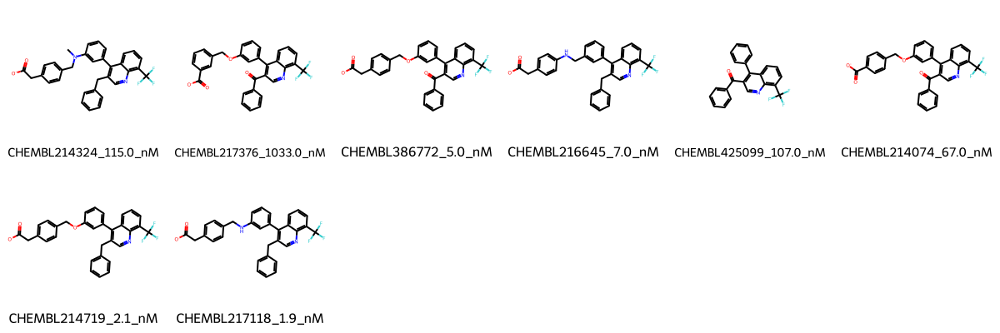
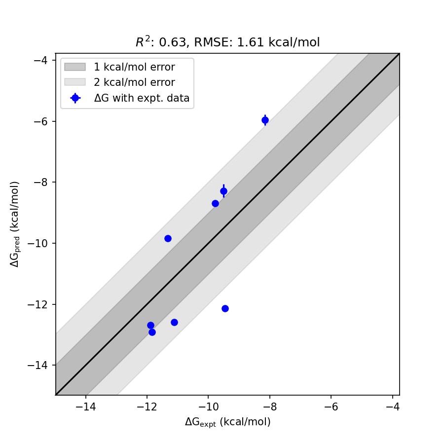

# NR1H2 System FEP Calculation Results Analysis

> This README is generated by AI model using verified experimental data and Uni-FEP calculation results. Content may contain inaccuracies and is provided for reference only. No liability is assumed for outcomes related to its use.

## Introduction

NR1H2 (Nuclear Receptor Subfamily 1 Group H Member 2), also known as LXRβ (Liver X Receptor Beta), is a nuclear receptor that plays crucial roles in cholesterol homeostasis, lipid metabolism, and inflammation. It functions as a ligand-activated transcription factor that regulates the expression of genes involved in cholesterol efflux and lipid metabolism. NR1H2 has emerged as an important therapeutic target for metabolic disorders, atherosclerosis, and inflammatory diseases.

## Molecules

The NR1H2 system dataset in this study consists of 8 compounds, featuring a core structure with a trifluoromethyl-substituted quinoline scaffold. The compounds share a common biphenyl system and demonstrate structural diversity through various linkers connecting to phenylacetic acid derivatives, including ether, amine, and N-methyl amine linkages. These molecules also show variation in their quinoline substituents, with either benzoyl or benzyl groups at the C3 position.

The experimentally determined binding affinities range from 1.9 nM to 1033 nM, spanning approximately three orders of magnitude, with binding free energies from -8.16 to -11.89 kcal/mol.

## Conclusions

The FEP calculation results for the NR1H2 system show good correlation with experimental data, achieving an R² of 0.63 and an RMSE of 1.61 kcal/mol. Several compounds demonstrated good prediction accuracy, such as CHEMBL425099 (experimental: -9.50 kcal/mol, predicted: -8.28 kcal/mol) and CHEMBL214074 (experimental: -9.78 kcal/mol, predicted: -8.70 kcal/mol). The predicted binding free energies ranged from -5.95 to -12.91 kcal/mol, showing some systematic overestimation for compounds with amine linkers.

## References

For more information about the NR1H2 target and associated bioactivity data, please visit:
https://www.ebi.ac.uk/chembl/explore/assay/CHEMBL907758 