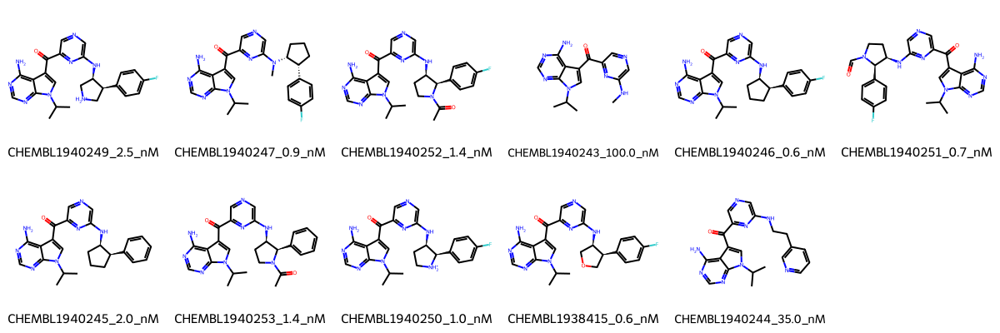

# PDPK1 System FEP Calculation Results Analysis

## Target Introduction

PDPK1 (3-Phosphoinositide Dependent Protein Kinase-1) is a master kinase that plays a crucial role in cell signaling by activating numerous downstream protein kinases. It is a key component of the PI3K/AKT signaling pathway and is involved in various cellular processes including cell growth, proliferation, and survival. PDPK1 has emerged as an important therapeutic target in cancer and metabolic diseases due to its central role in these signaling pathways.

## Dataset Analysis

The PDPK1 system dataset in this study consists of 11 compounds, featuring a core structure with a pyrimidine scaffold. The compounds share a common aminopyrimidine head group and a carbonyl linker connected to another pyrimidine ring. These molecules demonstrate structural diversity through various substituents at the terminal pyrimidine, including different cyclic amines with fluorophenyl groups and N-methylation patterns.

The experimentally determined binding affinities range from 0.6 nM to 100 nM, spanning approximately two orders of magnitude, with binding free energies from -9.54 to -12.57 kcal/mol.

## Conclusions

The FEP calculation results for the PDPK1 system show moderate correlation with experimental data, achieving an R² of 0.53 and an RMSE of 1.01 kcal/mol. Several compounds demonstrated good prediction accuracy, such as CHEMBL1938415 (experimental: -12.57 kcal/mol, predicted: -12.50 kcal/mol) and CHEMBL1940244 (experimental: -10.17 kcal/mol, predicted: -10.19 kcal/mol). The predicted binding free energies ranged from -8.58 to -13.96 kcal/mol, generally capturing the relative binding trends of the series.

## References

For more information about the PDPK1 target and associated bioactivity data, please visit:
https://www.ebi.ac.uk/chembl/explore/assay/CHEMBL1942054 