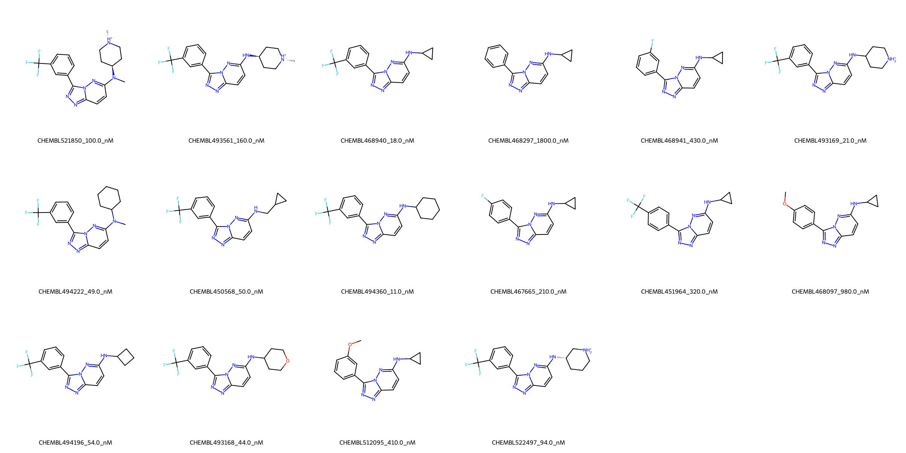

# PIM1 System FEP Calculation Results Analysis

## Target Introduction

PIM1 (Proto-oncogene serine/threonine-protein kinase Pim-1) is a constitutively active serine/threonine kinase that plays crucial roles in cell survival, proliferation, and differentiation. It is involved in various cellular processes including transcriptional regulation and cell cycle progression. PIM1 has emerged as an important therapeutic target in cancer treatment, particularly in hematological malignancies and solid tumors, due to its overexpression in various cancer types and its role in promoting cell survival.

## Dataset Analysis

The PIM1 system dataset in this study consists of 16 compounds, featuring a core structure with a pyrazolo[1,5-b][1,2,4]triazine scaffold. The compounds share a common trifluoromethylphenyl substituent and demonstrate structural diversity through various amine substituents at the triazine ring, including cyclopropyl, cyclohexyl, and piperazine derivatives. These molecules also show variation in their fluorination patterns and methoxy substitutions.

The experimentally determined binding affinities range from 11 nM to 1800 nM, spanning approximately two orders of magnitude, with binding free energies from -7.83 to -10.85 kcal/mol.

## Conclusions

The FEP calculation results for the PIM1 system show moderate correlation with experimental data, achieving an R² of 0.47 and an RMSE of 0.95 kcal/mol. Several compounds demonstrated good prediction accuracy, such as CHEMBL522497 (experimental: -9.58 kcal/mol, predicted: -9.61 kcal/mol) and CHEMBL512095 (experimental: -8.71 kcal/mol, predicted: -8.54 kcal/mol). The predicted binding free energies ranged from -6.67 to -11.56 kcal/mol, showing some systematic overestimation for compounds with piperazine substituents.

## References

For more information about the PIM1 target and associated bioactivity data, please visit:
https://www.ebi.ac.uk/chembl/explore/assay/CHEMBL1022925 