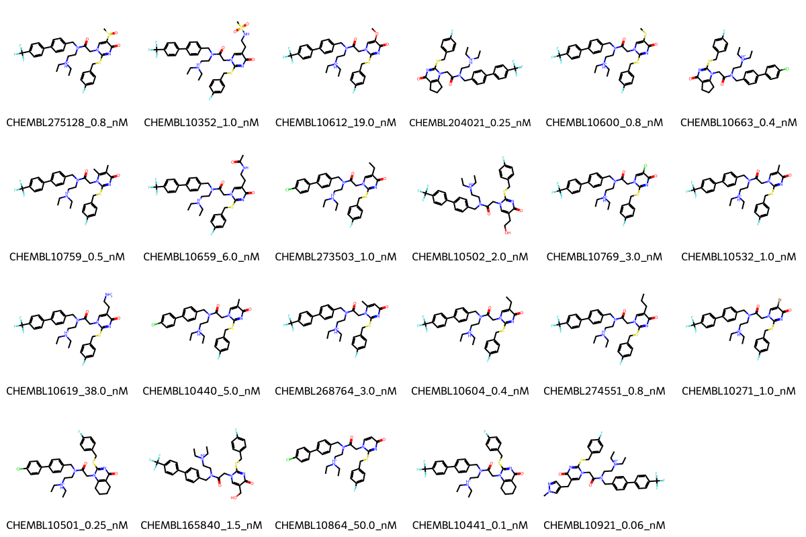

# PLA2G7 System FEP Calculation Results Analysis

> This README is generated by AI model using verified experimental data and Uni-FEP calculation results. Content may contain inaccuracies and is provided for reference only. No liability is assumed for outcomes related to its use.

## Introduction

PLA2G7 (Phospholipase A2 Group VII), also known as PAF-AH (Platelet-Activating Factor Acetylhydrolase), is a secreted enzyme that catalyzes the degradation of platelet-activating factor by hydrolyzing the sn-2 ester bond. It plays important roles in inflammation and oxidative stress by modifying oxidized phospholipids. PLA2G7 has emerged as an important therapeutic target for cardiovascular diseases and inflammatory conditions due to its involvement in lipid metabolism and inflammation.

## Molecules

The PLA2G7 system dataset in this study consists of 19 compounds, featuring a core structure with a pyrimidin-4(1H)-one scaffold. The compounds share a common fluorophenylthio linker and demonstrate structural diversity through various substituents at the C5 position of the pyrimidine ring, including alkyl, halogen, and cycloalkyl groups. These molecules also show variation in their biphenyl substituents, with either trifluoromethyl or chloro groups on the terminal phenyl ring.

The experimentally determined binding affinities range from 0.25 nM to 38 nM, spanning approximately two orders of magnitude, with binding free energies from -10.12 to -13.09 kcal/mol.

## Conclusions

The FEP calculation results for the PLA2G7 system show moderate correlation with experimental data, achieving an R² of 0.40 and an RMSE of 1.09 kcal/mol. Several compounds demonstrated good prediction accuracy, such as CHEMBL10440 (experimental: -11.32 kcal/mol, predicted: -11.90 kcal/mol) and CHEMBL10271 (experimental: -12.27 kcal/mol, predicted: -12.64 kcal/mol). The predicted binding free energies ranged from -9.40 to -14.50 kcal/mol, showing some systematic overestimation for compounds with cycloalkyl substituents.

## References

For more information about the PLA2G7 target and associated bioactivity data, please visit:
https://www.ebi.ac.uk/chembl/explore/assay/CHEMBL707410 