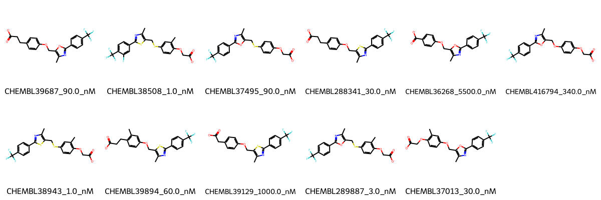

# PPARD System FEP Calculation Results Analysis

## Introduction

PPARD (Peroxisome Proliferator-Activated Receptor Delta), also known as PPARβ/δ, is a nuclear receptor that functions as a ligand-activated transcription factor. It plays crucial roles in lipid metabolism, glucose homeostasis, and inflammation. PPARD is widely expressed throughout the body and has emerged as an important therapeutic target for metabolic disorders, particularly in the treatment of dyslipidemia, obesity, and type 2 diabetes.

## Molecules

The PPARD system dataset comprises 11 compounds featuring a common structural framework with either oxazole or thiazole cores linked to a trifluoromethyl-substituted phenyl ring. These compounds demonstrate structural diversity through variations in their carboxylic acid-containing side chains and the nature of the linker (oxygen or sulfur) connecting to the heterocyclic core.

The experimental binding affinities span three orders of magnitude, ranging from 1 nM to 5500 nM, corresponding to binding free energies from -7.17 to -12.27 kcal/mol. The compounds with thiazole cores (e.g., CHEMBL38508 and CHEMBL38943) generally showed stronger binding affinities compared to their oxazole counterparts.

## Conclusions

The FEP calculations for the PPARD system demonstrated good correlation with experimental data, achieving an R² of 0.67 and an RMSE of 1.25 kcal/mol. Notable examples of accurate predictions include CHEMBL37013 (experimental: -10.26 kcal/mol, predicted: -10.26 kcal/mol) and CHEMBL289887 (experimental: -11.62 kcal/mol, predicted: -11.53 kcal/mol). The predictions captured the general trend of higher binding affinity for compounds with thiazole cores and optimal side chain lengths.

## References

For more information about the PPARD target and associated bioactivity data, please visit:
https://www.ebi.ac.uk/chembl/explore/assay/CHEMBL759401 