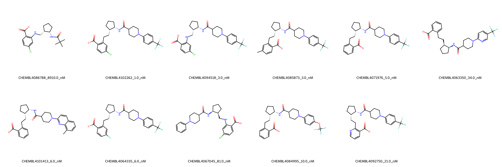

# PTGES System FEP Calculation Results Analysis

## Target Introduction

PTGES (Prostaglandin E Synthase), also known as mPGES-1, is a membrane-associated protein that catalyzes the conversion of prostaglandin H2 to prostaglandin E2. It plays a crucial role in prostaglandin biosynthesis and inflammatory responses. PTGES has emerged as an important therapeutic target for inflammatory diseases and pain management, offering potentially better safety profiles compared to traditional NSAIDs that target upstream enzymes in the prostaglandin synthesis pathway.

## Dataset Analysis

The PTGES system dataset in this study consists of 11 compounds, featuring a core structure with a benzoic acid scaffold connected to a trans-cyclohexyl linker. The compounds share a common carboxylic acid group and demonstrate structural diversity through various substituents including chloro, fluoro, and trifluoromethyl groups. These molecules also show variation in their piperidine-based substituents and the position of the carboxylic acid group on the aromatic ring.

The experimentally determined binding affinities range from 1.0 nM to 8910 nM, spanning approximately four orders of magnitude, with binding free energies from -6.89 to -12.27 kcal/mol.

## Conclusions

The FEP calculation results for the PTGES system show good correlation with experimental data, achieving an R² of 0.69 and an RMSE of 1.09 kcal/mol. Several compounds demonstrated excellent prediction accuracy, such as CHEMBL4092750 (experimental: -10.47 kcal/mol, predicted: -10.54 kcal/mol) and CHEMBL4084995 (experimental: -10.91 kcal/mol, predicted: -11.12 kcal/mol). The predicted binding free energies ranged from -9.94 to -11.17 kcal/mol, showing good agreement with the experimental range for most compounds, though with some compression of the predicted range compared to experiment.

## References

For more information about the PTGES target and associated bioactivity data, please visit:
https://www.ebi.ac.uk/chembl/explore/assay/CHEMBL3999537 