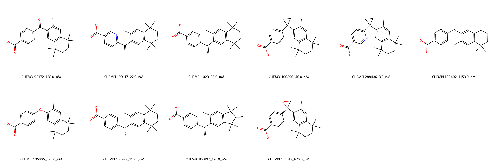

# RXRA System FEP Calculation Results Analysis

## Introduction

RXRA (Retinoid X Receptor Alpha) is a nuclear receptor that functions as a ligand-dependent transcription factor. It plays crucial roles in various biological processes, including development, cell differentiation, and metabolism. RXRA forms heterodimers with other nuclear receptors and is involved in the regulation of numerous genes. It has emerged as an important therapeutic target for various diseases, including cancer, metabolic disorders, and inflammatory conditions.

## Molecules

The RXRA system dataset consists of 10 compounds sharing a common structural framework featuring a tetralin or indane core substituted with a benzoic acid moiety. These compounds demonstrate structural diversity through various linking groups between the core and the benzoic acid, including direct bonds, alkene bridges, and cyclic connectors. The tetralin core is typically decorated with gem-dimethyl groups and additional methyl substituents.

The experimental binding affinities span about three orders of magnitude, ranging from 3 nM to 1159 nM, corresponding to binding free energies from -8.09 to -11.62 kcal/mol. The most potent compound (CHEMBL288436, 3 nM) features a pyridine carboxylic acid connected to the tetralin core through a cyclopropyl ring.

## Conclusions

The FEP calculations for the RXRA system demonstrated good correlation with experimental data, achieving an R² of 0.64 and an RMSE of 0.99 kcal/mol. Several compounds showed excellent prediction accuracy, such as CHEMBL105979 (experimental: -9.49 kcal/mol, predicted: -9.57 kcal/mol) and CHEMBL106837 (experimental: -9.21 kcal/mol, predicted: -9.24 kcal/mol). The predictions were particularly accurate for compounds with similar linking groups between the core and the benzoic acid moiety.

## References

For more information about the RXRA target and associated bioactivity data, please visit:
https://www.ebi.ac.uk/chembl/explore/assay/CHEMBL797916 