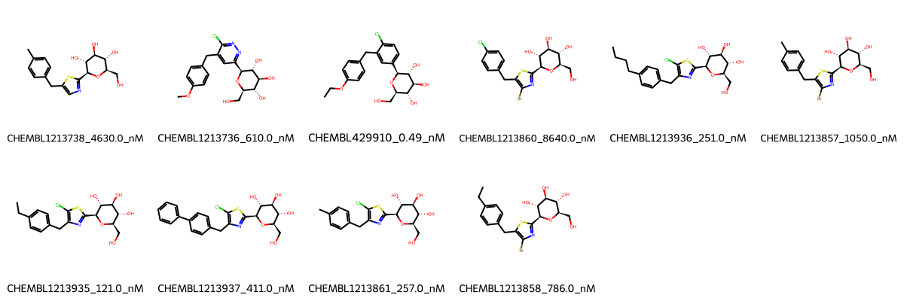

# SLC5A2 System FEP Calculation Results Analysis

## Target Introduction

SLC5A2 (Sodium-Glucose Cotransporter 2), also known as SGLT2, is a sodium-dependent glucose transporter primarily expressed in the proximal renal tubules. It plays a crucial role in glucose reabsorption from the glomerular filtrate back into the bloodstream. SLC5A2 has become an important therapeutic target for type 2 diabetes treatment, as its inhibition leads to increased urinary glucose excretion and reduced blood glucose levels. The development of SGLT2 inhibitors represents a significant advancement in diabetes management.

## Dataset Analysis

The SLC5A2 system dataset in this study comprises 10 compounds featuring a C-glycoside scaffold with various thiophene and phenyl substituents. These compounds share a common glucopyranose core structure essential for binding to the glucose transport channel. Key structural variations include different halogen substitutions (chloro and bromo) on the thiophene ring and various alkyl and aryl modifications on the phenyl ring.

The experimentally determined binding affinities span a remarkably wide range from 0.49 nM to 8640 nM, corresponding to binding free energies from -6.90 to -12.69 kcal/mol. This broad range of affinities, covering nearly four orders of magnitude, provides an excellent test set for evaluating the FEP methodology's predictive capabilities across different binding strengths.

## Conclusions

The FEP calculation results for the SLC5A2 system show moderate predictive performance with an R² of 0.56 and an RMSE of 1.07 kcal/mol. While some compounds showed good agreement between experimental and predicted values, such as CHEMBL1213861 (experimental: -8.99 kcal/mol, predicted: -8.82 kcal/mol), others displayed larger deviations. The most potent compound in the series, CHEMBL429910 (experimental: -12.69 kcal/mol), was predicted with a binding free energy of -11.06 kcal/mol, showing a reasonable agreement considering its exceptional potency.

The moderate correlation suggests that the complexity of the glucose transport channel and potential water-mediated interactions may present challenges for accurate FEP predictions in this system. The presence of multiple hydroxyl groups and the flexible nature of the C-glycoside scaffold might contribute to the observed deviations.

## References

For more information about the SLC5A2 target and associated bioactivity data, please visit:
https://www.ebi.ac.uk/chembl/explore/assay/CHEMBL1217373 