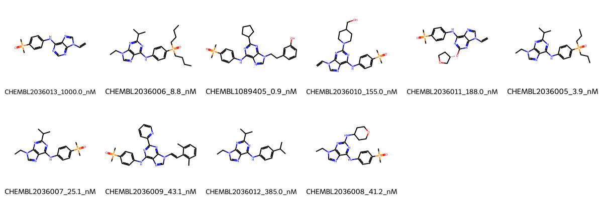

# SRC System FEP Calculation Results Analysis

> This README is generated by AI model using verified experimental data and Uni-FEP calculation results. Content may contain inaccuracies and is provided for reference only. No liability is assumed for outcomes related to its use.

## Introduction

SRC (Proto-oncogene tyrosine-protein kinase Src) is a non-receptor tyrosine kinase that plays crucial roles in cell growth, differentiation, migration, and survival signaling pathways. It is involved in the regulation of numerous cellular processes and has been implicated in the development and progression of various cancers. SRC has emerged as an important therapeutic target in cancer treatment, particularly in solid tumors where its overexpression or hyperactivation contributes to disease progression.

## Molecules

The SRC system dataset in this study consists of 10 compounds, featuring a core structure with a purine scaffold. The compounds share a common dimethylphosphine oxide-substituted aniline group and demonstrate structural diversity through various substituents at the purine N-9 position and C-6 position. These molecules exhibit different patterns of substitution including vinyl, isopropyl, and cycloalkyl groups.

The experimentally determined binding affinities range from 0.9 nM to 1000 nM, spanning approximately three orders of magnitude, with binding free energies from -8.18 to -12.33 kcal/mol.

## Conclusions

The FEP calculation results for the SRC system show excellent correlation with experimental data, achieving a high R² of 0.90, though with a relatively large RMSE of 1.36 kcal/mol. Several compounds demonstrated good prediction accuracy, such as CHEMBL2036007 (experimental: -10.36 kcal/mol, predicted: -9.66 kcal/mol) and CHEMBL2036012 (experimental: -8.75 kcal/mol, predicted: -9.06 kcal/mol). The predicted binding free energies ranged from -5.59 to -14.31 kcal/mol, showing some systematic overestimation of binding strength but generally capturing the relative binding trends.

## References

For more information about the SRC target and associated bioactivity data, please visit:
https://www.ebi.ac.uk/chembl/explore/assay/CHEMBL2039537 