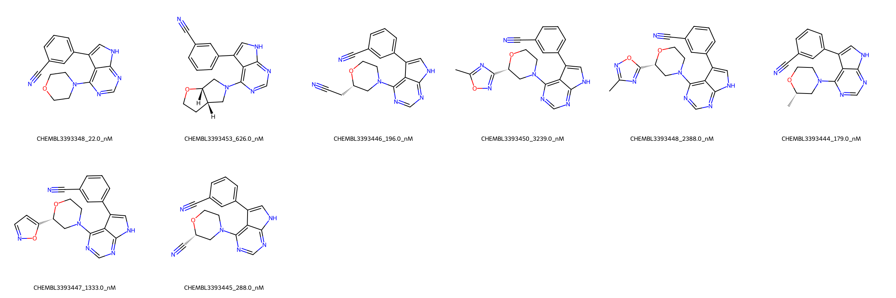

# STK3 System FEP Calculation Results Analysis

> This README is generated by AI model using verified experimental data and Uni-FEP calculation results. Content may contain inaccuracies and is provided for reference only. No liability is assumed for outcomes related to its use.

## Introduction

STK3 (Serine/Threonine Kinase 3), also known as MST2, is a key component of the Hippo signaling pathway, which plays crucial roles in organ size control, cell proliferation, apoptosis, and tumor suppression. It functions as a protein kinase that phosphorylates various downstream targets, including LATS1/2 kinases. STK3 has emerged as an important therapeutic target in cancer research due to its role in tumor suppression and cell death regulation.

## Molecules

The STK3 system dataset in this study consists of 8 compounds, featuring a core structure with a pyrimidine scaffold. The compounds share a common 4-cyanophenyl substituent and a morpholine-like ring system. These molecules demonstrate structural diversity through various substituents at the morpholine ring, including cyano, isoxazole, and simple alkyl groups.

The experimentally determined binding affinities range from 22 nM to 3239 nM, spanning approximately two orders of magnitude, with binding free energies from -7.49 to -10.44 kcal/mol.

## Conclusions

The FEP calculation results for the STK3 system show moderate correlation with experimental data, achieving an R² of 0.42 and an RMSE of 0.71 kcal/mol. Several compounds demonstrated reasonable prediction accuracy, such as CHEMBL3393444 (experimental: -9.20 kcal/mol, predicted: -8.79 kcal/mol) and CHEMBL3393445 (experimental: -8.92 kcal/mol, predicted: -8.76 kcal/mol). The predicted binding free energies ranged from -8.21 to -9.41 kcal/mol, generally capturing the relative binding trends of the series.

## References

For more information about the STK3 target and associated bioactivity data, please visit:
https://www.ebi.ac.uk/chembl/explore/assay/CHEMBL3395732 