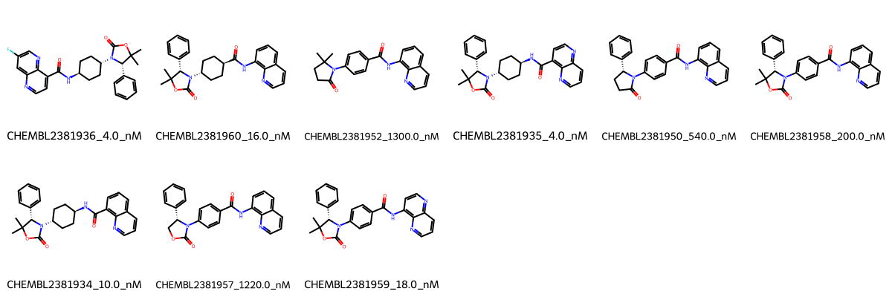

# TNKS System FEP Calculation Results Analysis

## Target Introduction

TNKS (Tankyrase-1/2), also known as PARP5a/PARP5b, belongs to the poly(ADP-ribose) polymerase (PARP) family of enzymes. These proteins play crucial roles in various cellular processes, including Wnt signaling pathway regulation, telomere maintenance, and mitotic spindle formation. TNKS has emerged as an important therapeutic target, particularly in cancer treatment, as its inhibition can suppress Wnt signaling, which is frequently dysregulated in various cancers. The development of selective TNKS inhibitors represents a promising strategy for cancer therapy.

## Dataset Analysis

The TNKS system dataset in this study comprises 9 compounds featuring a quinazoline-based scaffold with various substituents. These compounds share a common core structure that includes a quinazoline ring system connected to different amide-linked moieties. Key structural variations include modifications to the central quinazoline core (including fluorination) and diverse substituents on the phenyl ring, particularly involving different cyclic carbamate and lactam groups.

The experimentally determined binding affinities span a significant range from 4.0 nM to 1300.0 nM, corresponding to binding free energies from -8.03 to -11.45 kcal/mol. This range of affinities provides a good test set for evaluating the FEP methodology's predictive capabilities across different binding strengths.

## Conclusions

The FEP calculation results for the TNKS system demonstrate excellent predictive performance with an R² of 0.84 and an RMSE of 0.72 kcal/mol. Many compounds showed very good agreement between experimental and predicted values. For example, CHEMBL2381934 (experimental: -10.91 kcal/mol, predicted: -10.58 kcal/mol) and CHEMBL2381959 (experimental: -10.56 kcal/mol, predicted: -10.37 kcal/mol) showed particularly good correlation.

The most potent compounds in the series, CHEMBL2381935 and CHEMBL2381936 (both with experimental binding free energy of -11.45 kcal/mol), were predicted with binding free energies of -12.19 and -12.79 kcal/mol respectively, showing reasonable agreement despite slight overestimation of their binding strength.

The high correlation coefficient suggests that the FEP methodology effectively captures the key determinants of binding affinity in this system, including the interactions of the quinazoline core and the various substituents with the TNKS binding site.

## References

For more information about the TNKS target and associated bioactivity data, please visit:
https://www.ebi.ac.uk/chembl/explore/assay/CHEMBL2384487 