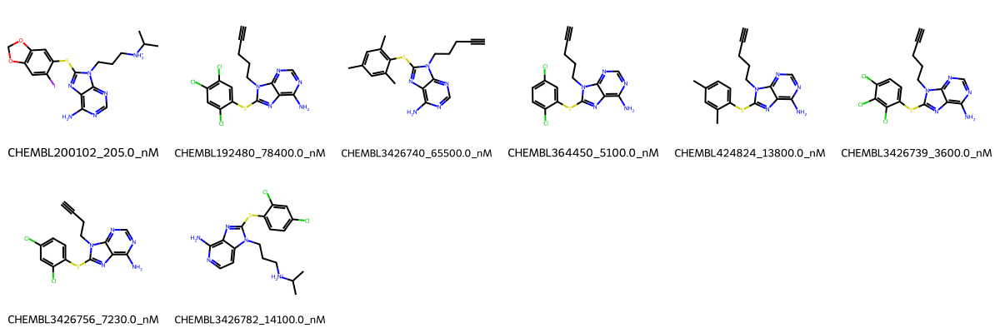

# TRAP1 System FEP Calculation Results Analysis

> This README is generated by AI model using verified experimental data and Uni-FEP calculation results. Content may contain inaccuracies and is provided for reference only. No liability is assumed for outcomes related to its use.

## Introduction

TRAP1 (TNF Receptor-Associated Protein 1), also known as HSP75, is a mitochondrial molecular chaperone belonging to the HSP90 family. It plays crucial roles in maintaining mitochondrial function, regulating cellular metabolism, and protecting against oxidative stress. TRAP1 has emerged as an important therapeutic target in cancer treatment due to its involvement in tumor cell survival and drug resistance mechanisms.

## Molecules

The TRAP1 system dataset in this study consists of 8 compounds, featuring a core structure with a purine scaffold. The compounds share a common aminopyrimidine head group and a thioether linker connected to various substituted phenyl rings. These molecules demonstrate structural diversity through different halogen substitution patterns (chloro, iodo) and alkyl groups, as well as variations in the terminal amine substituents.

The experimentally determined binding affinities range from 205 nM to 78.4 μM, spanning approximately three orders of magnitude, with binding free energies from -5.60 to -9.12 kcal/mol.

## Conclusions

The FEP calculation results for the TRAP1 system show moderate correlation with experimental data, achieving an R² of 0.57 and an RMSE of 1.33 kcal/mol. Several compounds demonstrated reasonable prediction accuracy, such as CHEMBL3426782 (experimental: -6.61 kcal/mol, predicted: -6.94 kcal/mol) and CHEMBL3426756 (experimental: -7.01 kcal/mol, predicted: -6.50 kcal/mol). The predicted binding free energies ranged from -4.45 to -11.47 kcal/mol, generally capturing the relative binding trends of the series.

## References

For more information about the TRAP1 target and associated bioactivity data, please visit:
https://www.ebi.ac.uk/chembl/explore/assay/CHEMBL3427925 