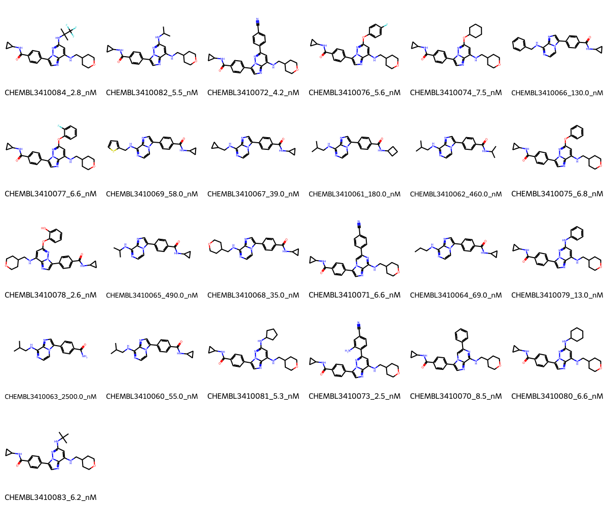

# TTK System FEP Calculation Results Analysis

## Introduction

TTK (also known as MPS1, Monopolar Spindle 1) is a dual-specificity protein kinase that plays a crucial role in cell cycle regulation, particularly during mitosis. It is essential for proper chromosome segregation and the spindle assembly checkpoint. TTK has emerged as an important therapeutic target in cancer treatment, as its overexpression has been observed in various types of cancers. Inhibition of TTK has shown promise in cancer therapy by disrupting cell division in cancer cells.

## Molecules

The TTK system dataset in this study comprises 25 compounds, featuring a pyrazolo[1,5-a]pyrimidine scaffold as the core structure. These compounds exhibit molecular weights typically ranging from 400 to 500 Da. The series demonstrates structural diversity through various substituents, including cyclopropyl amides, cyano groups, and different amine substitutions at key positions. A notable feature is the presence of a tetrahydrofuran-containing substituent in many of the more potent compounds.

The experimentally determined binding affinities range from 2.5 nM to 2500 nM, spanning approximately three orders of magnitude, with binding free energies from -7.64 to -11.73 kcal/mol.

## Conclusions

The FEP calculation results for the TTK system demonstrate strong predictive performance with an R² of 0.74 and an RMSE of 0.86 kcal/mol. The predicted binding free energies (-7.92 to -13.79 kcal/mol) show good correlation with experimental values. Several compounds showed excellent prediction accuracy, such as CHEMBL3410083 (experimental: -11.19 kcal/mol, predicted: -11.29 kcal/mol) and CHEMBL3410080 (experimental: -11.15 kcal/mol, predicted: -11.33 kcal/mol). The most potent compound, CHEMBL3410073, with an experimental binding free energy of -11.73 kcal/mol, was well predicted at -11.96 kcal/mol.

## References

For more information about the TTK target and associated bioactivity data, please visit:
https://www.ebi.ac.uk/chembl/explore/assay/CHEMBL3411333 