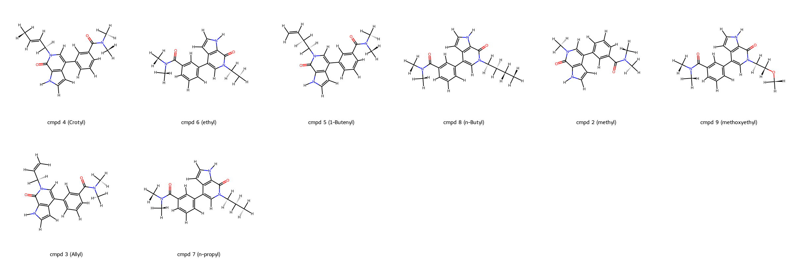
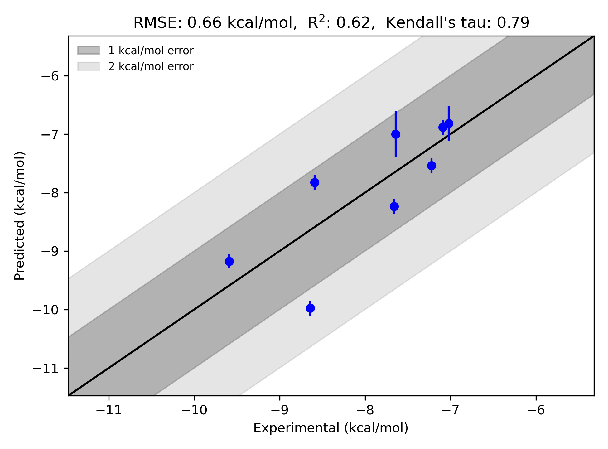

# BRD4-1 System FEP Calculation Results Analysis

> This README is generated by an AI model using verified experimental data and Uni-FEP calculation results. Content may contain inaccuracies and is provided for reference only. No liability is assumed for outcomes related to its use.

## Introduction

BRD4-1 (Bromodomain-containing protein 4, domain 1) is part of the bromodomain and extra-terminal (BET) family of proteins, which are known for recognizing acetylated lysine residues on histone tails. BRD4-1 plays a pivotal role in chromatin remodeling and transcription regulation by recruiting co-factors and enabling RNA polymerase II activation during transcriptional elongation. Its function in regulating gene expression has made it a significant target in drug discovery for therapeutic applications in cancer, as well as inflammatory and autoimmune diseases. Inhibiting BRD4-1 with small molecules has shown promise in interfering with its interactions with acetylated histones, opening new possibilities for treating conditions such as leukemia, solid tumors, and other BRD4-1-related diseases.

## Molecules

The BRD4-1 system dataset in this study includes 8 small molecules designed to target the bromodomain binding site. These compounds exhibit diversity in their chemical substituents, offering a broad exploration of chemical space and their impact on binding interactions. The experimental binding free energies range from -7.22 to -9.59 kcal/mol, corresponding to affinities spanning micromolar to nanomolar concentrations. This dataset provides valuable insights into structure-activity relationships (SARs) and is well-suited for studying computational modeling approaches and binding affinity predictions.

## Conclusions

The FEP calculations for the BRD4-1 system demonstrate reliable predictive accuracy, with an RMSE of 0.66 kcal/mol and an R² of 0.62. The results indicate a strong correlation between the experimental and predicted binding free energies. Compound 4 (Crotyl) displayed excellent agreement between experimental and predicted ΔG values, with an experimental ΔG of -8.64 kcal/mol and a predicted ΔG of -9.97 kcal/mol. Similarly, compound 2 (Methyl) showed close alignment, with an experimental ΔG of -9.59 kcal/mol and a predicted ΔG of -9.17 kcal/mol.

These results highlight the utility of FEP calculations in supporting structure-based drug design and optimization efforts for BRD4-1 inhibitors, offering insights into binding energetics and SARs relevant to therapeutic discovery.

## References

For additional information about BRD4-1 and its role in drug discovery, please refer to the following article:  
- Filippakopoulos, P., et al. (2010). Selective inhibition of BET bromodomains. *Nature*, 468(7327), 1067–1073. [DOI:10.1038/nature09504]