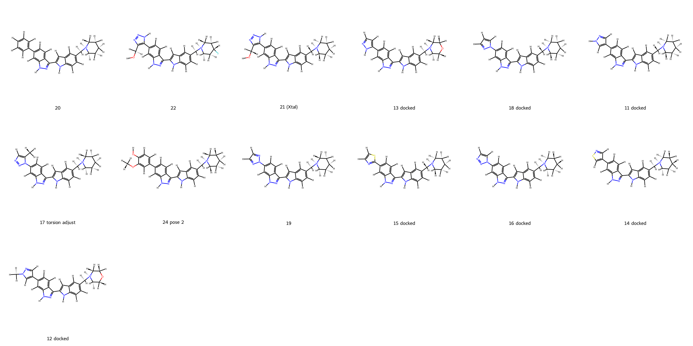
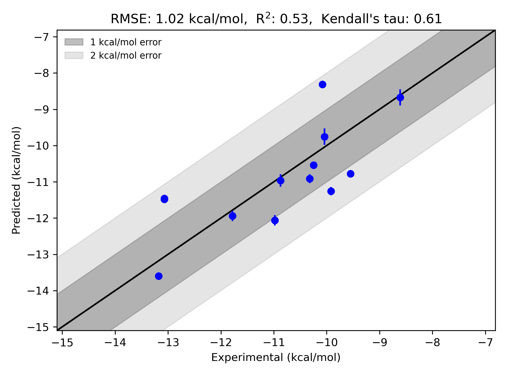

# Chk1-Waterset System FEP Calculation Results Analysis

> This README is generated by AI model using verified experimental data and Uni-FEP calculation results. Content may contain inaccuracies and is provided for reference only. No liability is assumed for outcomes related to its use.

## Introduction

Checkpoint kinase 1 (Chk1) is a serine/threonine-specific protein kinase that plays an essential role in maintaining genomic integrity and coordinating cellular responses to DNA damage. It is a key mediator in the cell cycle checkpoint pathway, ensuring accurate DNA replication and repair during genotoxic stress. Chk1 is particularly critical for the survival of cancer cells, as these cells often experience high levels of replication stress. Due to its critical role, Chk1 has become an attractive target for cancer therapy, with inhibitors being developed to selectively sensitize tumor cells to chemotherapeutic agents or radiation treatment. By exploiting the reliance of tumor cells on Chk1-mediated pathways, Chk1 inhibitors can selectively induce cancer cell death while sparing normal cells.

## Molecules

The Chk1-Waterset dataset comprises 12 diverse ligands with a shared molecular scaffold that enables interactions with the Chk1 active site. Variations across the dataset are primarily observed in the substituents and stereochemistry on this scaffold, offering a broad spectrum of physicochemical characteristics and binding preferences. Binding free energies derived from experimental measurements span a range of approximately -8.61 to -13.17 kcal/mol. This dataset represents a valuable benchmark for the assessment of computational methods in predicting ligand binding affinities.

## Conclusions

The FEP calculation results for the Chk1-Waterset system demonstrate solid predictive performance, attaining an RMSE of 1.02 kcal/mol and an R² of 0.53. The model successfully captured the critical binding trends across the dataset, with several ligands showing strong agreement between experimental and predicted binding free energies. Notably, **ligand 24 (pose 2)** exhibited excellent prediction accuracy, with an experimental binding free energy of -13.1773 kcal/mol closely aligned with a predicted value of -13.601 kcal/mol and a minimal standard deviation of 0.056 kcal/mol. Similarly, **ligand 22** demonstrated robust predictive performance, with an experimental binding free energy of -13.0686 kcal/mol corresponding well to a predicted value of -11.4586 kcal/mol. These results highlight the reliability of FEP-based predictions in characterizing the binding affinity landscape of diverse Chk1 ligands.