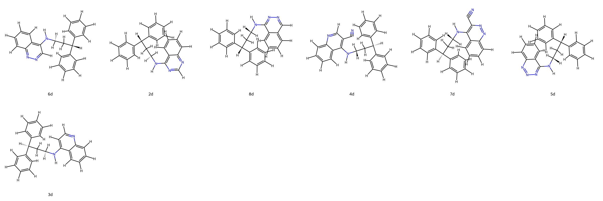
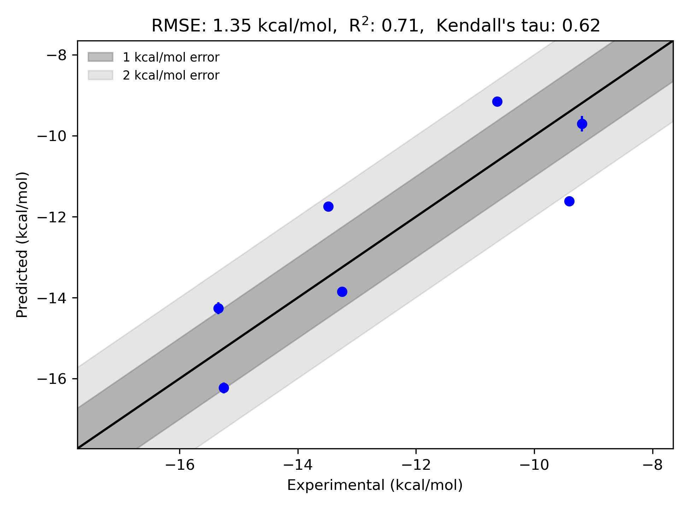

# Scytalone Target FEP Calculation Results Analysis

> This README is generated by an AI model using verified experimental data and Uni-FEP calculation results. Content may contain inaccuracies and is provided for reference only. No liability is assumed for outcomes related to its use.

## Introduction

Scytalone is a pivotal intermediate in the fungal melanin biosynthetic pathway, which plays an essential role in the survival and pathogenicity of numerous fungal species. Melanin, as a protective pigment, enables fungi to withstand environmental stressors such as ultraviolet radiation, reactive oxygen species, and immune defenses from host organisms. Specifically, melanin production is crucial for the virulence of plant pathogens like *Magnaporthe oryzae*, which causes rice blast disease, a significant threat to global rice production. By focusing on scytalone's function within this biochemical pathway, researchers aim to develop potent antifungal agents that can disrupt melanin biosynthesis, providing novel strategies for antifungal drug discovery.

## Molecules

The dataset analyzed in this study consists of seven ligands targeting scytalone, showcasing various functional groups and structural modifications. These ligands include substituted aromatic and heteroaromatic scaffolds, incorporating species such as cyano groups and complex stereochemical configurations. The structural diversity underscores the distinct binding properties of each ligand within the scytalone interaction space.

The experimentally determined binding free energy values span a notable range, from -9.19 kcal/mol to -15.34 kcal/mol. This diverse dataset highlights the effectiveness of scytalone's molecular recognition and the potency of its inhibitors. Such analyses facilitate an in-depth understanding of ligand binding dynamics and inform further optimization efforts for scytalone inhibitors.

## Conclusions

The FEP calculation results for the scytalone target demonstrate a reliable level of agreement with experimental binding data, achieving a correlation coefficient (R²) of 0.71 and an RMSE of 1.35 kcal/mol. This performance underscores the predictive power of computational methods in capturing ligand-target interactions for scytalone. 

Notably, specific compounds showcase exceptional agreement between experimental and predicted data, lending credibility to the computational approaches employed. For instance, **7d** exhibits an experimental binding free energy of -15.25 kcal/mol and a predicted value of -16.23 kcal/mol, while **4d** has an experimental binding free energy of -15.34 kcal/mol and a predicted value of -14.26 kcal/mol. Such strong alignment illustrates the calculated model's ability to capture complex binding phenomena.

This study emphasizes the capacity of computational tools to deliver insights into ligand specificity and thermodynamics, furthering the scope for rational design of advanced antifungal agents.