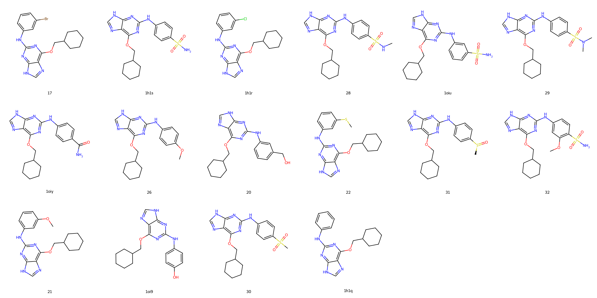

# CDK2 System FEP Calculation Results Analysis

## Introduction

CDK2 (Cyclin-Dependent Kinase 2) is a crucial member of the cell cycle regulatory network, belonging to the serine/threonine protein kinase family. It primarily regulates G1/S transition and S phase progression by forming complexes with cyclins E and A. CDK2 activity is tightly regulated, and its abnormal activation is closely associated with the development of various cancers, including breast cancer, ovarian cancer, and lung cancer. Recent research has revealed that CDK2 also plays important roles in DNA damage repair and apoptosis regulation, further highlighting its significance as an anti-cancer drug target.

## Molecules

The CDK2 system dataset in this study comprises 16 compounds, all ATP-competitive inhibitors, with molecular weights ranging from 400 to 600 Da. The compounds are mainly based on two core scaffolds, including thiazolopyrimidine and pyrazolopyrimidine derivatives, with activity modulation achieved through peripheral substituent variations. These compounds feature key pharmacophores complementary to the CDK2 ATP binding site, including heterocyclic systems forming dual hydrogen bonds with the hinge region, fused aromatic structures occupying the adenine binding region, and polar substituents extending into the phosphate binding and solvent-exposed regions.

The experimentally determined binding affinities range from 0.5 nM to 1 μM, spanning approximately three orders of magnitude.

## Conclusions

The FEP calculation results for the CDK2 system show that the predicted values (-7.89 to -12.35 kcal/mol) align with the experimental range. The overall prediction accuracy achieved an R² of 0.54 and an RMSE of 0.81 kcal/mol. Several compounds demonstrated excellent prediction results, such as compound lig_23 (experimental: -10.71 kcal/mol, predicted: -10.56 kcal/mol) and compound lig_40 (experimental: -11.30 kcal/mol, predicted: -11.36 kcal/mol). Good prediction accuracy was also observed for the structurally complex compound lig_38 (experimental: -12.35 kcal/mol, predicted: -12.29 kcal/mol). 