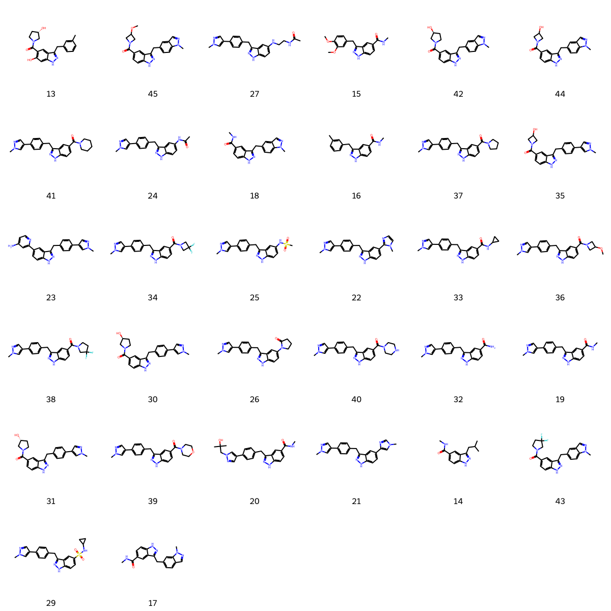

# CDK8 System FEP Calculation Results Analysis

## Target Introduction

CDK8 (Cyclin-Dependent Kinase 8) is a crucial member of the transcriptional regulatory network and a component of the Mediator complex. Unlike other CDK family members, CDK8 primarily participates in transcriptional regulation rather than cell cycle control. It regulates gene expression by phosphorylating RNA polymerase II and other transcription factors. Research has shown that abnormal activation of CDK8 is closely associated with the development of various cancers, particularly colorectal cancer and leukemia. CDK8 influences tumor growth and metastasis by regulating important signaling pathways such as Wnt/β-catenin and p53. Therefore, CDK8 has emerged as a novel target for anti-cancer drug development, making the development of its inhibitors clinically significant.

## Dataset Analysis

The CDK8 system dataset in this study includes 32 compounds, primarily ATP-competitive inhibitors, with molecular weights ranging from 400 to 650 Da. These compounds feature key structural characteristics complementary to the CDK8 ATP binding site, including heterocyclic systems forming hydrogen bonds with the hinge region, hydrophobic groups occupying the adenine binding region, and variable substituents extending into the phosphate binding and solvent-exposed regions. The compounds exhibit moderate flexibility, with relatively rigid core scaffolds and conformationally flexible peripheral substituents.

The experimentally determined binding free energies range from -7.64 to -11.86 kcal/mol.

## Conclusions

The FEP calculation results for the CDK8 system show that the predicted values (-6.23 to -12.84 kcal/mol) closely align with the experimental range. The overall prediction accuracy achieved an R² of 0.84 and an RMSE of 0.87 kcal/mol. Several compounds demonstrated excellent prediction results, such as compound 20 (experimental: -10.63 kcal/mol, predicted: -10.91 kcal/mol) and compound 17 (experimental: -8.93 kcal/mol, predicted: -8.90 kcal/mol). Good prediction accuracy was also observed for the structurally complex compound 31 (experimental: -11.86 kcal/mol, predicted: -12.18 kcal/mol). 