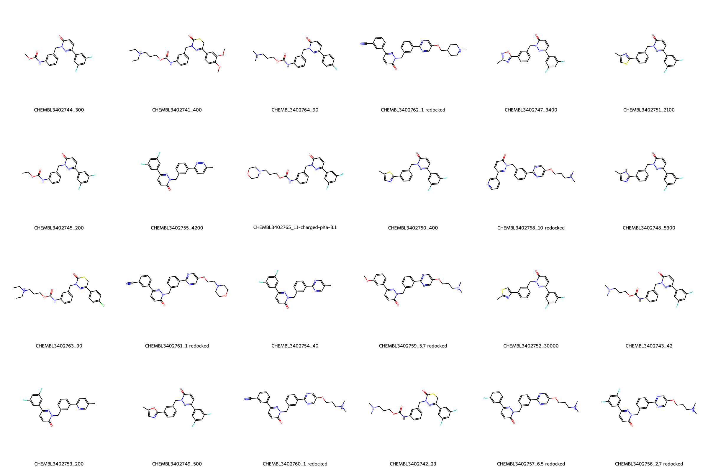

# c-Met System FEP Calculation Results Analysis

## Target Introduction

c-Met (Hepatocyte Growth Factor Receptor, HGFR) is a receptor tyrosine kinase that plays crucial roles in embryonic development, tissue repair, and organ regeneration. Through binding with its ligand HGF (Hepatocyte Growth Factor), it activates multiple downstream signaling pathways to regulate cell proliferation, migration, invasion, and survival. Abnormal activation of c-Met is closely associated with the occurrence, development, and metastasis of various malignant tumors, including lung cancer, gastric cancer, liver cancer, and colorectal cancer. Particularly in certain cancers, c-Met amplification or mutation leads to its constitutive activation, becoming a key driver of tumor progression. Therefore, c-Met has become an important target for anti-cancer drug development, with its inhibitors showing significant clinical value.

## Dataset Analysis

The c-Met system dataset in this study comprises 24 compounds, primarily ATP-competitive inhibitors, with molecular weights ranging from 300 to 600 Da. These compounds feature key pharmacophores targeting the c-Met kinase domain, including hydrogen bond donors/acceptors for hinge region binding, aromatic ring systems for hydrophobic pocket occupation, and variable substituents in the solvent-exposed region. The compounds typically contain 2-3 freely rotatable bonds, with key pharmacophores maintaining relatively fixed spatial orientations while substituents in the solvent-exposed region exhibit some conformational diversity.

The experimentally determined binding free energies range from -6.17 to -12.27 kcal/mol.

## Conclusions

The FEP calculation results for the c-Met system show that the predicted values (-5.80 to -13.82 kcal/mol) closely align with the experimental range. The overall prediction accuracy achieved an R² of 0.79 and an RMSE of 1.01 kcal/mol. Several compounds demonstrated excellent prediction results, such as compound CHEMBL3402756 (experimental: -11.68 kcal/mol, predicted: -11.61 kcal/mol) and compound CHEMBL3402757 (experimental: -11.16 kcal/mol, predicted: -11.27 kcal/mol). Good prediction accuracy was also observed for the structurally complex compound CHEMBL3402760 (experimental: -12.27 kcal/mol, predicted: -12.43 kcal/mol). 