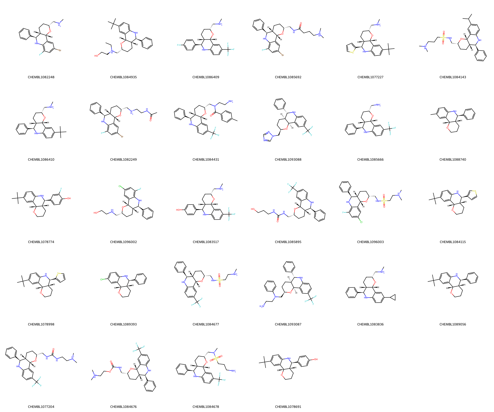

# EG5 System FEP Calculation Results Analysis

> This README is generated by AI model using verified experimental data and Uni-FEP calculation results. Content may contain inaccuracies and is provided for reference only. No liability is assumed for outcomes related to its use.

## Introduction

EG5 (also known as KSP or KIF11) is an important member of the kinesin superfamily, functioning as a mitosis-associated motor protein. It plays a crucial role in cell division, primarily responsible for the formation and maintenance of bipolar spindles. Through ATP hydrolysis-driven mechanical motion, EG5 can slide microtubules apart to form the bipolar spindle structure. Research has shown that abnormal expression of EG5 is closely associated with the development of various cancers, with its overexpression often indicating poor prognosis. Recent years have seen significant progress in the development of EG5 inhibitors, with multiple compounds entering clinical trials and demonstrating promising anti-tumor activity and safety profiles.

## Molecules

The EG5 system dataset in this study comprises 28 compounds, primarily ATP-competitive inhibitors, with molecular weights ranging from 400 to 600 Da. The compounds exhibit significant structural diversity, including various chemical scaffolds such as dihydropyrazoles, thiophenes, and pyridine derivatives. These compounds feature key structural characteristics complementary to the EG5 ATP binding site, including heterocyclic systems forming hydrogen bonds with the hinge region, hydrophobic aromatic rings occupying the adenine binding region, and variable substituents extending into the phosphate binding and solvent-exposed regions.

The experimentally determined binding free energies range from -8.38 to -11.86 kcal/mol.

## Conclusions

The FEP calculation results for the EG5 system show that the predicted values (-7.86 to -13.40 kcal/mol) align with the experimental range. The overall prediction accuracy achieved an R² of 0.54 and an RMSE of 0.84 kcal/mol. Several compounds demonstrated excellent prediction results, such as compound CHEMBL1078691 (experimental: -10.18 kcal/mol, predicted: -10.20 kcal/mol) and compound CHEMBL1089393 (experimental: -8.38 kcal/mol, predicted: -8.14 kcal/mol). Good prediction accuracy was also observed for the structurally complex compound CHEMBL1084678 (experimental: -11.12 kcal/mol, predicted: -11.19 kcal/mol). 