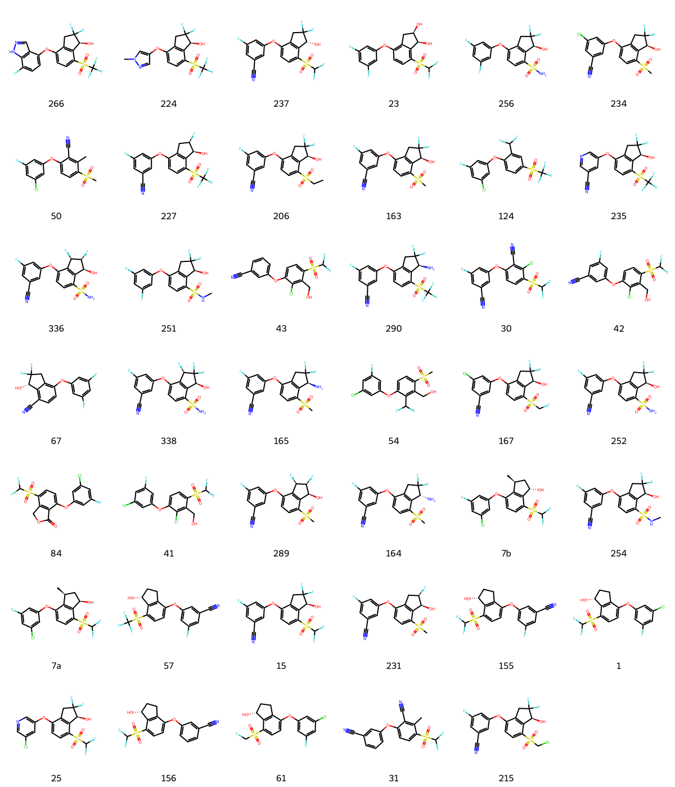

# HIF-2α System FEP Calculation Results Analysis

## Target Introduction

HIF-2α (Hypoxia-Inducible Factor-2α) is a crucial transcription factor that plays a central role in cellular adaptation to hypoxic conditions. It forms a heterodimer with HIF-1β to regulate the expression of multiple genes involved in angiogenesis, erythropoiesis, glucose metabolism, and cell survival. In the tumor microenvironment, abnormal activation of HIF-2α promotes tumor angiogenesis, metabolic reprogramming, and metastasis, particularly playing a significant role in renal cell carcinoma. Recent years have seen important breakthroughs in the development of small molecule inhibitors targeting HIF-2α, with belzutifan being approved for the treatment of VHL disease-associated renal cell carcinoma, demonstrating good clinical efficacy.

## Dataset Analysis

The HIF-2α system dataset in this study comprises 41 compounds, primarily small molecule inhibitors, with molecular weights ranging from 400 to 650 Da. The compounds exhibit significant structural diversity with various chemical scaffolds, all designed to bind to the PAS-B domain of HIF-2α. These compounds feature key structural characteristics complementary to the HIF-2α binding pocket, including polar groups forming hydrogen bonds with key residues, aromatic ring systems occupying hydrophobic cavities, and substituents forming additional interactions with the protein surface.

The experimentally determined binding free energies range from -6.76 to -11.32 kcal/mol.

## Conclusions

The FEP calculation results for the HIF-2α system show that the predicted values (-6.06 to -14.82 kcal/mol) align with the experimental range. The overall prediction accuracy achieved an R² of 0.22 and an RMSE of 1.54 kcal/mol. Several compounds demonstrated excellent prediction results, such as compound 31 (experimental: -8.84 kcal/mol, predicted: -8.73 kcal/mol) and compound 61 (experimental: -10.10 kcal/mol, predicted: -9.91 kcal/mol). Good prediction accuracy was also observed for the structurally complex compound 215 (experimental: -10.59 kcal/mol, predicted: -10.48 kcal/mol). 