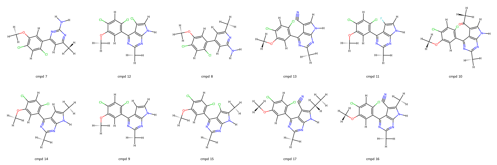
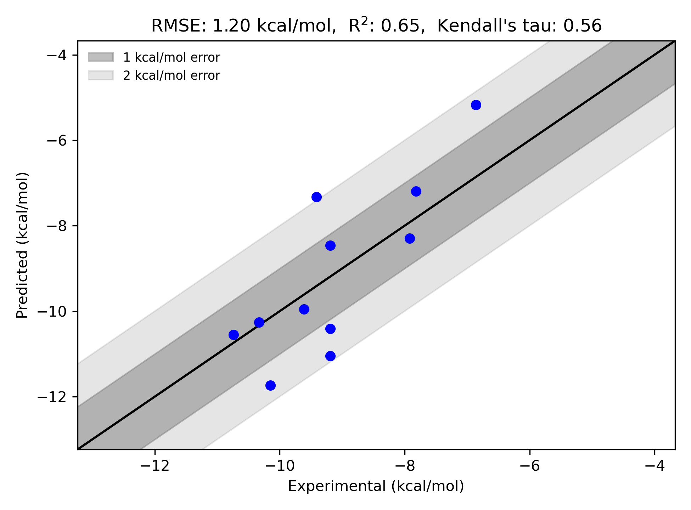

# Hsp90 System FEP Calculation Results Analysis

> This README is generated by an AI model using verified experimental data and Uni-FEP calculation results. Content may contain inaccuracies and is provided for reference only. No liability is assumed for outcomes related to its use.

## Introduction

Hsp90 (Heat Shock Protein 90) is a highly conserved molecular chaperone critical to the folding, stability, and activation of a wide range of client proteins involved in various cellular processes. It plays pivotal roles in regulating signaling pathways associated with protein kinases, transcription factors, and steroid hormone receptors. Due to its unique role in maintaining the function of multiple oncogenic proteins, Hsp90 has emerged as a key therapeutic target in cancer research, with particular relevance in breast cancer, lung cancer, and leukemia. Moreover, its importance extends to investigations in neurodegenerative diseases and viral infections, making Hsp90 an essential target for drug discovery.

## Molecules

The Hsp90 dataset analyzed in this study includes 11 ligands with a focus on structural diversity and functional group optimization to enhance binding interactions within the Hsp90 binding pocket. These molecules exhibit variations in functional groups and stereochemistry, contributing to distinct binding modes and affinities with the target.

The experimentally determined binding free energies (ΔG) range from -6.86 kcal/mol to -10.74 kcal/mol, reflecting the potency spread across the selected ligands. This dataset provides valuable insights for modeling studies and serves as a robust framework for computational evaluations of ligand-protein interactions.

## Conclusions

The FEP calculation results for the Hsp90 dataset align well with experimental data, achieving an R² of 0.65 and an RMSE of 1.20 kcal/mol. This demonstrates the reliability of the computational approach in replicating thermodynamic trends in ligand binding.

Notable cases of strong prediction accuracy include "cmpd 13," which exhibited an experimental ΔG of -10.15 kcal/mol and a predicted ΔG of -11.74 kcal/mol. Additionally, "cmpd 17" displayed excellent agreement, with an experimental ΔG of -10.74 kcal/mol and a predicted ΔG of -10.55 kcal/mol. These examples underscore the ability of the computational methodology to capture the relative binding trends and provide meaningful guidance in the iterative design of Hsp90 inhibitors.
