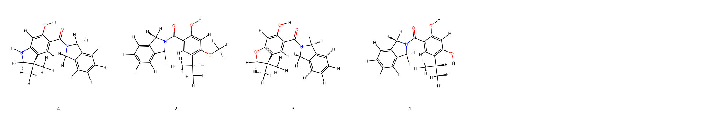

# Hsp90 System FEP Calculation Results Analysis  

> This README is generated by AI model using verified experimental data and Uni-FEP calculation results. Content may contain inaccuracies and is provided for reference only. No liability is assumed for outcomes related to its use.  

## Introduction  

Heat shock protein 90 (Hsp90) is an essential and highly conserved molecular chaperone that plays a key role in the stabilization, activation, and proper folding of numerous client proteins. It is involved in various cellular processes, ensuring protein homeostasis under both physiological and stress conditions. Hsp90 plays a critical role in cancer biology by stabilizing multiple oncoproteins that drive tumor growth, survival, and metastasis. Consequently, Hsp90 has emerged as a pivotal therapeutic target for cancer treatment, particularly as an inhibitor of oncogenic signaling pathways. Targeting Hsp90 is a promising strategy to disrupt multiple cancer-related pathways simultaneously, making it a focus of drug development efforts.  

## Molecules  

  

The Hsp90 system dataset evaluated in this study consists of 4 compounds with diverse functional groups and stereochemical configurations, all based on a central molecular framework that facilitates Hsp90 binding. Notable structural variations include hydroxyl and methoxy substituents, which contribute to their differential binding affinities.  

The experimentally derived binding affinities for these compounds range from -12.72 to -8.08 kcal/mol. The variations in binding free energies underscore the influence of substituent patterns on Hsp90 inhibition, providing valuable insights into the structure-affinity relationships of these inhibitors.  

## Conclusions  

The FEP calculation results for the Hsp90 system showcase excellent agreement with experimental data, achieving an R² value of 0.95 and an RMSE of 0.43 kcal/mol. These metrics underline the accuracy of the computational approach in predicting binding affinities for Hsp90 inhibitors.  

Among the evaluated compounds, ligand "4" exhibited an experimental binding free energy of -8.93 kcal/mol, closely matched by a predicted value of -9.49 kcal/mol. Another notable example is ligand "1," which demonstrated an experimental binding free energy of -12.72 kcal/mol with a predicted value of -12.97 kcal/mol. These cases emphasize the robustness of the predictive model in capturing the binding trends and absolute free energy values, supporting its application in the design of novel Hsp90 inhibitors.  