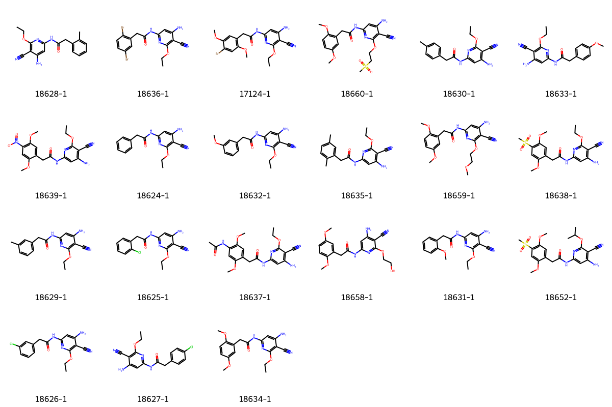
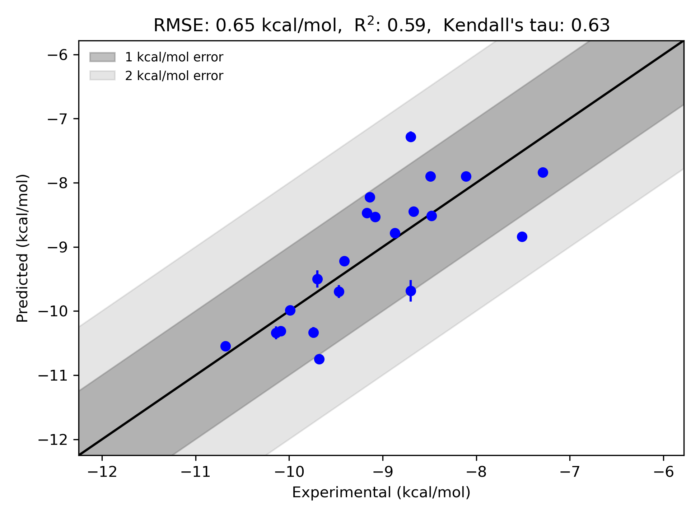

# JNK1 System FEP Calculation Results Analysis

> This README is generated by AI model using verified experimental data and Uni-FEP calculation results. Content may contain inaccuracies and is provided for reference only. No liability is assumed for outcomes related to its use.

## Introduction

JNK1 (c-Jun N-terminal Kinase 1) is a key member of the Mitogen-Activated Protein Kinase (MAPK) family, playing crucial roles in cellular stress response, inflammatory response, and apoptosis. It primarily functions by phosphorylating transcription factor c-Jun and other substrates to regulate cellular responses to environmental stress. Abnormal activation of JNK1 is closely associated with various diseases, including neurodegenerative disorders, inflammatory diseases, diabetes, and cancer. Therefore, JNK1 has become a potential therapeutic target for multiple diseases, making the development of its inhibitors clinically significant.

## Molecules

The JNK1 system dataset in this study comprises 21 compounds, primarily ATP-competitive inhibitors, with molecular weights ranging from 400 to 550 Da. The compounds are mainly pyridopyrimidine derivatives sharing similar core scaffolds, with activity modulation achieved through peripheral substituent modifications. These compounds feature key structural characteristics complementary to the JNK1 ATP binding site, including heterocyclic systems forming hydrogen bonds with hinge region residues, hydrophobic aromatic rings occupying the ATP binding pocket, and variable substituents extending into solvent-exposed regions.

The experimentally determined binding free energies range from -7.29 to -10.68 kcal/mol.

## Conclusions

The FEP calculation results for the JNK1 system show that the predicted values (-7.28 to -10.75 kcal/mol) closely align with the experimental range. The overall prediction accuracy achieved an R² of 0.59 and an RMSE of 0.65 kcal/mol. Several compounds demonstrated excellent prediction results, such as compound 18634-1 (experimental: -9.99 kcal/mol, predicted: -9.99 kcal/mol) and compound 18626-1 (experimental: -8.87 kcal/mol, predicted: -8.79 kcal/mol). Good prediction accuracy was also observed for the structurally complex compound 18652-1 (experimental: -10.68 kcal/mol, predicted: -10.55 kcal/mol). 