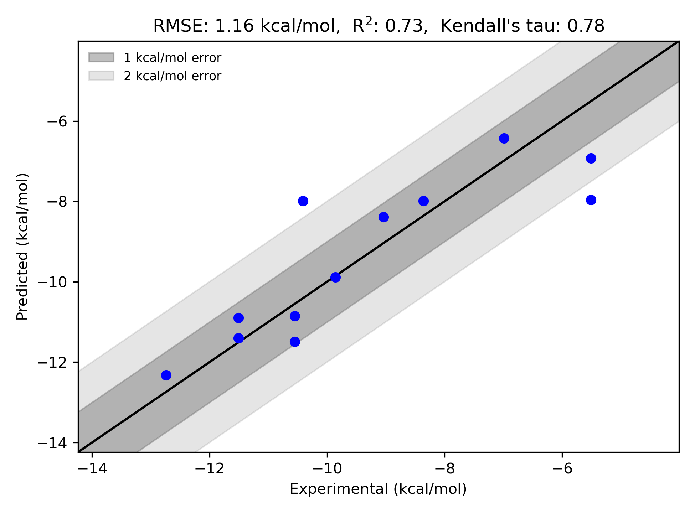

# mGluR5 System FEP Calculation Results Analysis

> This README is generated by AI model using verified experimental data and Uni-FEP calculation results. Content may contain inaccuracies and is provided for reference only. No liability is assumed for outcomes related to its use.

## Introduction

Metabotropic glutamate receptor 5 (mGluR5) is a class C G protein-coupled receptor that plays crucial roles in synaptic plasticity, learning, and memory. It has been implicated in various neurological and psychiatric disorders, including anxiety, depression, pain, and neurodegenerative diseases. As a result, mGluR5 negative allosteric modulators (NAMs) have emerged as promising therapeutic agents for these conditions, with particular interest in their potential to treat anxiety and pain disorders.

## Molecules

The mGluR5 system dataset in this study consists of 12 compounds, featuring a pyrimidine core structure linked to various substituted phenyl rings. The compounds share a common pyrazole moiety and demonstrate structural diversity through different substitution patterns, including cyano, fluoro, and chloro groups at various positions. Notable variations include the position and nature of electron-withdrawing groups on the phenyl ring.

The experimentally determined binding free energies span a range from -5.51 to -12.74 kcal/mol, representing a significant range of binding affinities that covers more than 7 orders of magnitude in terms of binding constants.

## Conclusions

The FEP calculation results for the mGluR5 system show good correlation with experimental data, achieving an R² of 0.73 and an RMSE of 1.16 kcal/mol. Several compounds demonstrated excellent prediction accuracy, such as compound 6 (experimental: -9.86 kcal/mol, predicted: -9.89 kcal/mol) and compound 13 (experimental: -11.51 kcal/mol, predicted: -11.40 kcal/mol). The predicted binding free energies ranged from -6.43 to -12.32 kcal/mol, effectively capturing the relative binding trends of the series.

## References

> Christopher JA, Aves SJ, Bennett KA, Dore AS, Errey JC, Jazayeri A, Marshall FH, Okrasa K, Serrano-Vega MJ, Tehan BG, Wiggin GR. Fragment and structure-based drug discovery for a class C GPCR: discovery of the mGlu5 negative allosteric modulator HTL14242 (3-chloro-5-[6-(5-fluoropyridin-2-yl) pyrimidin-4-yl] benzonitrile). Journal of medicinal chemistry. 2015 Aug 27;58(16):6653-64. 