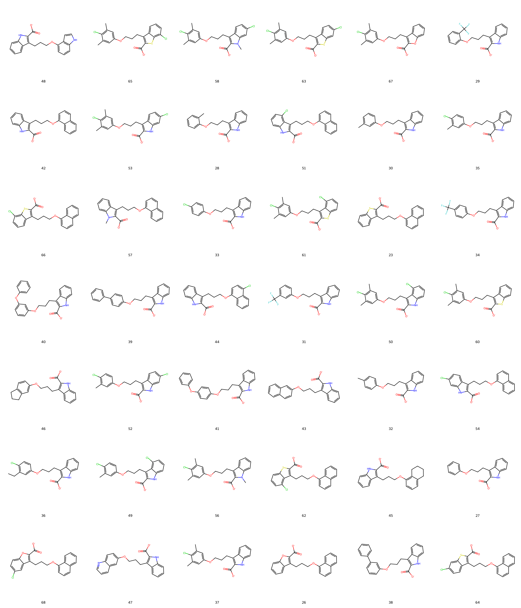

# MCL1 System FEP Calculation Results Analysis

## Target Introduction

MCL1 (Myeloid Cell Leukemia 1) is a crucial member of the Bcl-2 family, functioning as an anti-apoptotic protein that plays a key role in cell survival and apoptosis regulation. It primarily works by binding to pro-apoptotic proteins (such as Bim and Bak) to inhibit cell apoptosis. MCL1 overexpression is common in various cancers and is closely associated with tumor cell survival, chemotherapy resistance, and poor prognosis. Particularly in hematological malignancies, MCL1 is often considered a critical survival factor. Therefore, MCL1 has become an important target for anti-cancer drug development, making the development of its inhibitors clinically significant.

## Dataset Analysis

The MCL1 system dataset in this study comprises 42 compounds, primarily protein-protein interaction (PPI) inhibitors, with molecular weights ranging from 500 to 800 Da. The compounds are mainly benzothiazole derivatives sharing similar core scaffolds but exhibiting significant structural diversity in peripheral substituents. These compounds feature key structural characteristics complementary to the MCL1 binding groove, including hydrophobic aromatic systems mimicking the BH3 domain, polar groups forming crucial hydrogen bonds, and variable substituents extending into different sub-pockets.

The experimentally determined binding free energies range from -5.78 to -9.96 kcal/mol.

## Conclusions

The FEP calculation results for the MCL1 system show that the predicted values (-3.52 to -11.95 kcal/mol) align with the experimental range. The overall prediction accuracy achieved an R² of 0.57 and an RMSE of 1.19 kcal/mol. Several compounds demonstrated excellent prediction results, such as compound 26 (experimental: -8.24 kcal/mol, predicted: -8.35 kcal/mol) and compound 64 (experimental: -9.50 kcal/mol, predicted: -9.47 kcal/mol). Good prediction accuracy was also observed for the structurally complex compound 36 (experimental: -8.18 kcal/mol, predicted: -8.59 kcal/mol). 