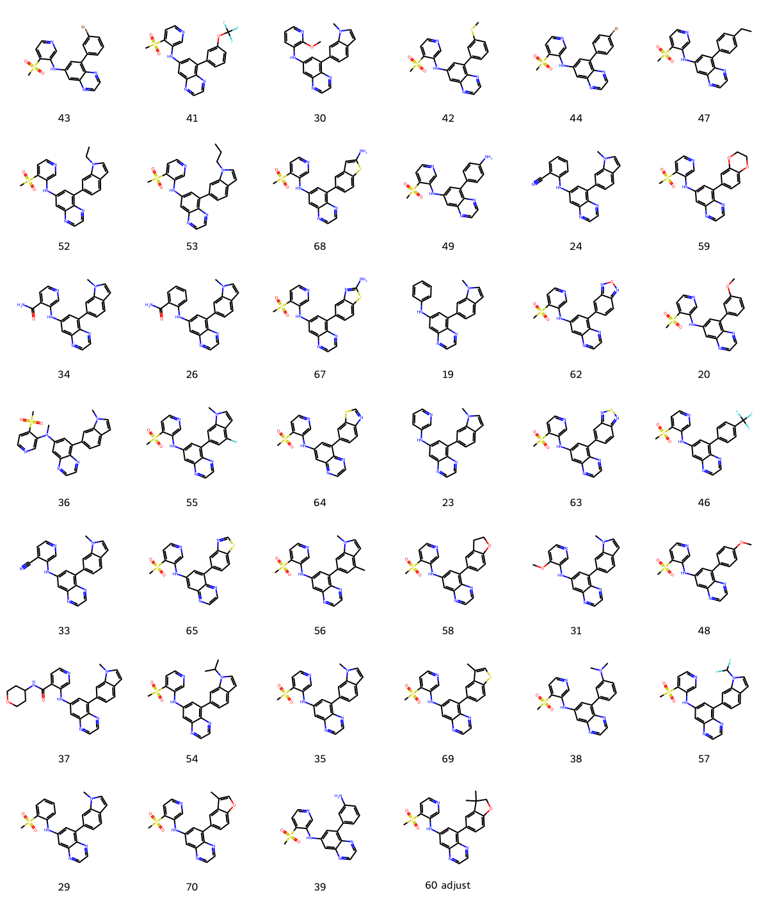

# PFKFB3 System FEP Calculation Results Analysis

## Target Introduction

PFKFB3 (6-Phosphofructo-2-Kinase/Fructose-2,6-Bisphosphatase 3) is a bifunctional enzyme that plays a crucial regulatory role in glycolysis. It regulates glycolytic flux by controlling the levels of fructose-2,6-bisphosphate (F2,6BP), with its kinase activity significantly exceeding its phosphatase activity, making it an important positive regulator of glycolysis. Research has shown that PFKFB3 is overexpressed in various cancers, and its hyperactivation leads to the "Warburg effect" in cancer cells, where glycolysis is preferred even under aerobic conditions. Particularly in rapidly proliferating tumor cells, PFKFB3 inhibition may suppress tumor growth by interfering with energy metabolism. Therefore, PFKFB3 has emerged as a novel target for anti-cancer drug development, making its inhibitors promising for clinical applications.

## Dataset Analysis

The PFKFB3 system dataset in this study comprises 40 compounds, all ATP-competitive inhibitors, with molecular weights ranging from 350 to 500 Da. The compounds are mainly pyrazolopyrimidine derivatives sharing similar core scaffolds while exhibiting significant structural diversity in peripheral substituents. These compounds feature key structural characteristics complementary to the PFKFB3 ATP binding site, including heterocyclic systems forming hydrogen bonds with hinge region residues, hydrophobic aromatic rings occupying the ATP binding pocket, and variable substituents extending into specificity pockets.

The experimentally determined binding free energies range from -6.99 to -10.71 kcal/mol.

## Conclusions

The FEP calculation results for the PFKFB3 system show that the predicted values (-6.54 to -11.40 kcal/mol) align with the experimental range. The overall prediction accuracy achieved an R² of 0.39 and an RMSE of 1.06 kcal/mol. Several compounds demonstrated excellent prediction results, such as compound 69 (experimental: -10.71 kcal/mol, predicted: -10.56 kcal/mol) and compound 70 (experimental: -10.30 kcal/mol, predicted: -10.36 kcal/mol). 