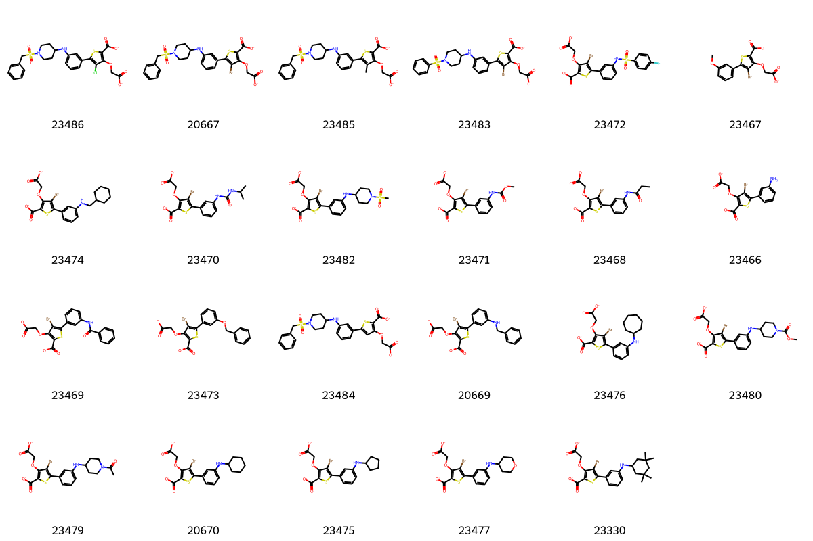

# PTP1B System FEP Calculation Results Analysis

## Target Introduction

PTP1B (Protein Tyrosine Phosphatase 1B) is an important non-receptor protein tyrosine phosphatase that plays a crucial negative regulatory role in insulin and leptin signaling pathways. As the primary phosphatase for insulin and leptin receptors, PTP1B activity is closely associated with insulin resistance and obesity. Research has shown that PTP1B inhibition can enhance insulin sensitivity and improve energy metabolism, making it an ideal target for treating type 2 diabetes and obesity. Additionally, abnormal PTP1B expression is associated with certain types of cancer. Due to its significant role in metabolic diseases, the development of PTP1B inhibitors has been an important direction in drug development.

## Dataset Analysis

The PTP1B system dataset in this study comprises 23 compounds, all competitive inhibitors, with molecular weights ranging from 300 to 450 Da. The compounds are mainly thiophene derivatives sharing similar core scaffolds, with activity modulation achieved through peripheral substituent modifications. These compounds feature key structural characteristics complementary to the PTP1B catalytic site, including electrophilic groups interacting with the catalytic cysteine, aromatic ring systems occupying the phosphotyrosine binding pocket, and variable substituents extending into the secondary binding site.

The experimentally determined binding affinities range from 1 nM to 1 μM, spanning approximately three orders of magnitude.

## Conclusions

The FEP calculation results for the PTP1B system show that the predicted values (-8.06 to -10.20 kcal/mol) align with the experimental range. The overall prediction accuracy achieved an R² of 0.57 and an RMSE of 0.91 kcal/mol. Several compounds demonstrated excellent prediction results, such as compound 23330 (experimental: -10.13 kcal/mol, predicted: -10.20 kcal/mol) and compound 23474 (experimental: -9.11 kcal/mol, predicted: -9.94 kcal/mol). 