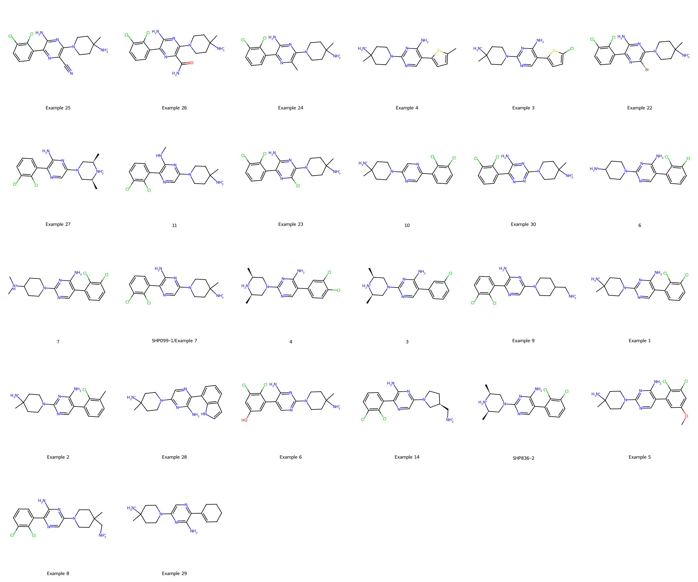
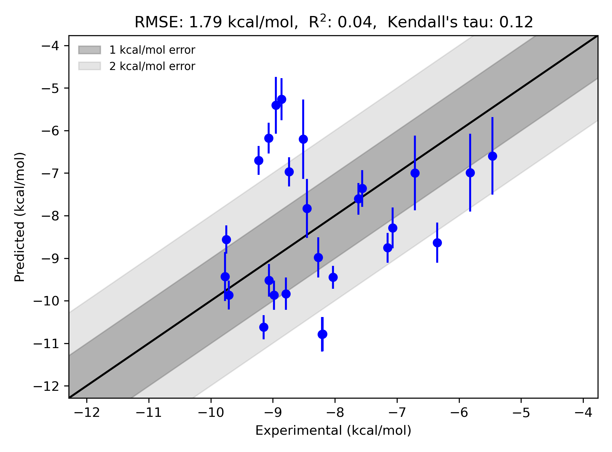

# SHP2 System FEP Calculation Results Analysis

> This README is generated by AI model using verified experimental data and Uni-FEP calculation results. Content may contain inaccuracies and is provided for reference only. No liability is assumed for outcomes related to its use.

## Introduction

SHP2 (Src Homology Region 2 Domain-containing Phosphatase-2) is a non-receptor protein tyrosine phosphatase that plays a crucial role in cell signal transduction. It regulates multiple signaling pathways, including RAS-MAPK and PI3K-AKT, participating in important physiological processes such as cell proliferation, differentiation, and migration. Gain-of-function mutations in SHP2 are associated with various types of cancers, particularly in leukemia, breast cancer, and lung cancer. Additionally, SHP2 is implicated in developmental disorders such as Noonan syndrome, making it an important target for drug development.

## Molecules

The SHP2 system dataset in this study comprises 26 compounds, all competitive inhibitors, with molecular weights ranging from 400 to 550 Da. The compounds are mainly nitrogen-containing heterocyclic derivatives, maintaining similar core scaffolds while exhibiting significant structural diversity in peripheral substituents. These compounds feature key structural characteristics including polar groups forming specific interactions with catalytic site residues, aromatic ring systems occupying hydrophobic pockets, and variable substituents modulating selectivity.

The experimentally determined binding affinities range from 1 nM to 10 μM, spanning approximately four orders of magnitude.

## Conclusions

The FEP calculation results for the SHP2 system show that the predicted values (-5.26 to -10.79 kcal/mol) align with the experimental range. The overall prediction accuracy achieved an R² of 0.04 and an RMSE of 1.79 kcal/mol. Some compounds demonstrated good prediction results, such as Example 29 (experimental: -7.62 kcal/mol, predicted: -7.61 kcal/mol) and Example 8 (experimental: -9.71 kcal/mol, predicted: -9.87 kcal/mol). 