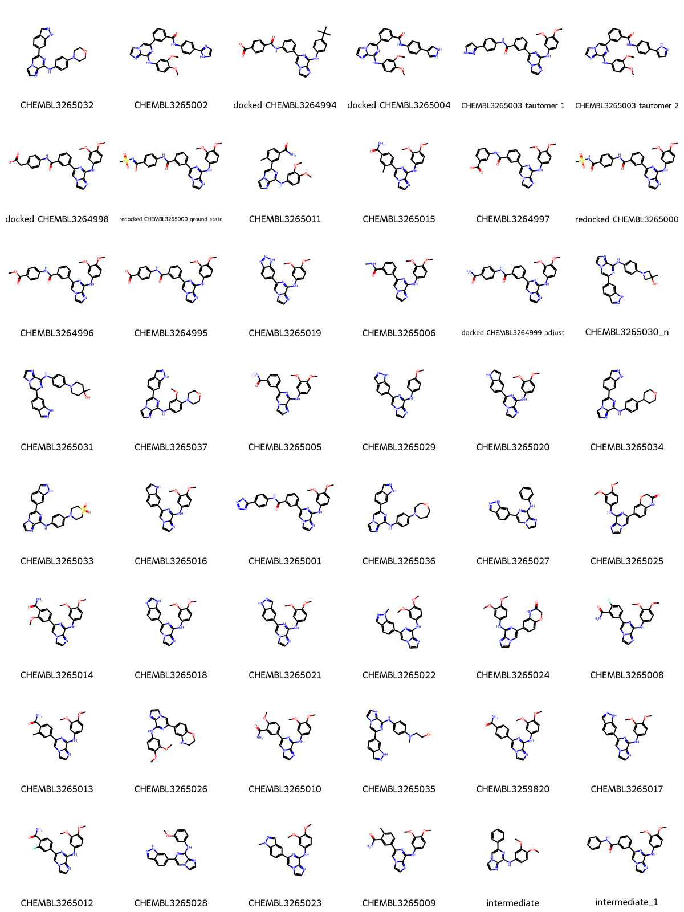

# SYK System FEP Calculation Results Analysis

> This README is generated by AI model using verified experimental data and Uni-FEP calculation results. Content may contain inaccuracies and is provided for reference only. No liability is assumed for outcomes related to its use.

## Introduction

SYK (Spleen Tyrosine Kinase) is a non-receptor tyrosine kinase that plays a crucial role in immune cell signal transduction. As an essential component of B-cell receptor (BCR) and Fc receptor signaling pathways, SYK regulates the development, activation, and function of immune cells. Research has shown that abnormal activation of SYK is closely associated with various autoimmune diseases (such as rheumatoid arthritis and systemic lupus erythematosus) and hematological malignancies. Particularly in B-cell lymphoma, SYK inhibition has demonstrated significant therapeutic effects. Therefore, SYK has become an important target for drug development in treating autoimmune diseases and hematological tumors.

## Molecules

The SYK system dataset in this study comprises 19 compounds, all ATP-competitive inhibitors, with molecular weights ranging from 400 to 550 Da. The compounds are mainly pyrazolopyrimidine derivatives sharing similar core scaffolds, with activity and selectivity modulation achieved through peripheral substituent modifications. These compounds feature key structural characteristics complementary to the SYK ATP binding site, including heterocyclic systems forming hydrogen bonds with hinge region residues, hydrophobic aromatic rings occupying the ATP binding pocket, and variable substituents extending into specificity pockets.

The experimentally determined binding affinities range from 0.1 nM to 100 nM, spanning approximately three orders of magnitude.

## Conclusions

The FEP calculation results for the SYK system show that the predicted values (-6.26 to -14.50 kcal/mol) closely align with the experimental range. The overall prediction accuracy achieved an R² of 0.26 and an RMSE of 1.56 kcal/mol. Several compounds demonstrated excellent prediction results, such as compound CHEMBL3265017 (experimental: -11.48 kcal/mol, predicted: -11.27 kcal/mol) and compound CHEMBL3259820 (experimental: -10.57 kcal/mol, predicted: -10.80 kcal/mol). 