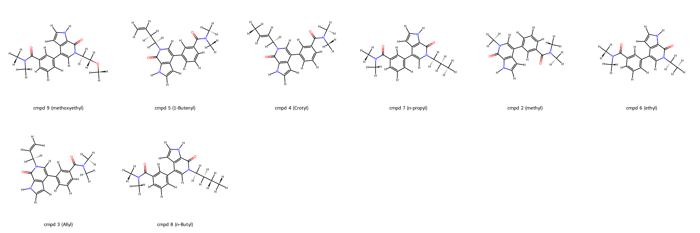
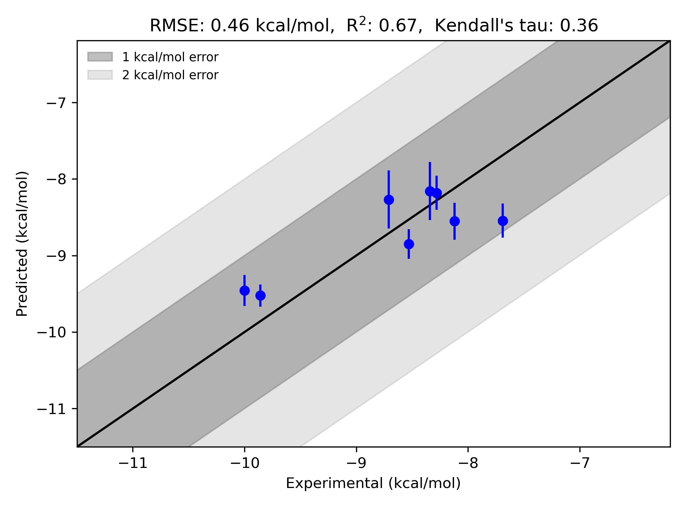

# TAF12-Waterset System FEP Calculation Results Analysis

> This README is generated by AI model using verified experimental data and Uni-FEP calculation results. Content may contain inaccuracies and is provided for reference only. No liability is assumed for outcomes related to its use.

## Introduction

TAF12 (TATA-box-binding protein-associated factor 12) is an integral component of the TFIID complex, a central player in the basal transcription machinery of RNA polymerase II. This protein plays essential roles in transcription initiation by facilitating interactions with core promoter elements and recruiting transcriptional cofactors. TAF12 is also implicated in chromatin remodeling, DNA binding, and transcription activation. These critical biological roles make it a subject of substantial interest in research focused on gene expression, transcriptional regulation, and drug discovery.

## Molecules

The TAF12-Waterset dataset investigated comprises 8 structurally diverse compounds designed to explore interactions within the TAF12 binding site. These compounds feature a common core framework with substitutions that vary in hydrophobicity, size, and polar functionalities. The series spans a range of binding free energies (∆G) measured experimentally, from -7.69 kcal/mol to -10.00 kcal/mol. Representative compounds include cmpd 9 (methoxyethyl), cmpd 5 (1-Butenyl), and cmpd 4 (Crotyl), showcasing functional group diversity and structural modifications aimed at optimizing interactions in the TAF12 active site.

## Conclusions

The FEP calculations for the TAF12-Waterset dataset demonstrate a strong level of accuracy in predicting binding free energies. With an R² value of 0.67 and an RMSE of 0.46 kcal/mol, the predictions show reliable consistency with experimental data across this chemical series. Notably, cmpd 9 (methoxyethyl) exhibited excellent agreement between experimental and predicted values, with an experimental ∆G of -7.69 kcal/mol and a predicted ∆G of -8.54 kcal/mol. Similarly, cmpd 5 (1-Butenyl) showed a close alignment between its experimental ∆G of -10.00 kcal/mol and predicted ∆G of -9.46 kcal/mol. These results underscore the potential of computational methods to capture binding affinity trends across diverse ligand series and support their utility in structural optimization and molecular design.