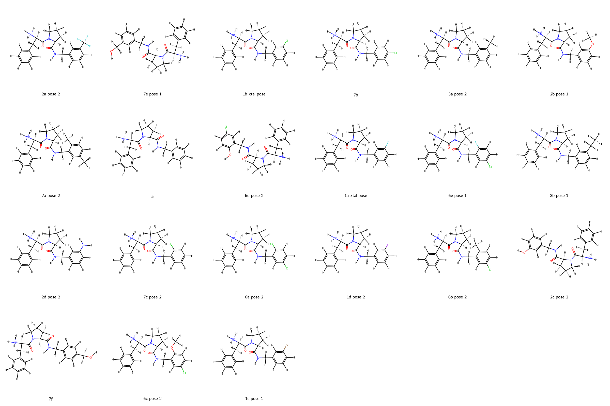
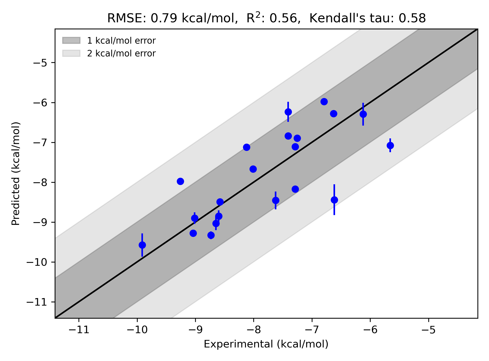

# Throm-Waterset System FEP Calculation Results Analysis

> This README is generated by AI model using verified experimental data and Uni-FEP calculation results. Content may contain inaccuracies and is provided for reference only. No liability is assumed for outcomes related to its use.

## Introduction

Thrombin is a serine protease enzyme that plays an essential role in the blood coagulation cascade by converting soluble fibrinogen into insoluble fibrin, which is a critical component of blood clots. Beyond its function in the coagulation cascade, thrombin also participates in processes such as wound healing, cell signaling, and inflammation. As a result of its central role in coagulation, thrombin has been identified as a key drug target for anticoagulant therapies intended to prevent and treat thromboembolic disorders such as deep vein thrombosis, atrial fibrillation, and myocardial infarction. Its inhibition is strategically significant for therapeutic interventions that aim to regulate pathological clot formation without significantly impairing normal hemostasis.

## Molecules

The throm-waterset dataset contains a variety of ligands representing a wide chemical diversity. Key features of the molecules include halogenated aromatic rings, hydroxyl-substituted scaffolds, and flexible aliphatic chains, all of which influence their interaction with the thrombin active site. The binding free energy range spans from approximately -5.65 kcal/mol to -9.91 kcal/mol, indicating a rich dataset to study diverse ligand-protein interactions.

## Conclusions

The FEP calculation results for the throm-waterset system demonstrate robust predictive accuracy with an RMSE of 0.79 kcal/mol and an R² value of 0.56. Several ligands, such as "6b pose 2" (experimental: -9.04 kcal/mol, predicted: -9.28 kcal/mol) and "6d pose 2" (experimental: -8.73 kcal/mol, predicted: -9.33 kcal/mol), validate the accuracy of the computational predictions with close alignment to the experimental data. The dataset's structural diversity was captured effectively, underscoring the capacity of computational methods to deliver meaningful insights into thrombin-ligand binding interactions.
