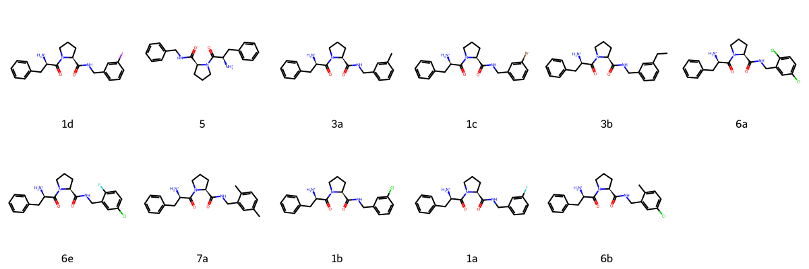

# Thrombin System FEP Calculation Results Analysis

> This README is generated by AI model using verified experimental data and Uni-FEP calculation results. Content may contain inaccuracies and is provided for reference only. No liability is assumed for outcomes related to its use.

## Introduction

Thrombin is a key serine protease in the coagulation cascade, playing central roles in blood coagulation, platelet activation, and inflammatory responses. As the central regulator of the coagulation system, thrombin generates fibrin by cleaving fibrinogen while also participating in platelet activation and the activation of various coagulation factors. Research has shown that dysregulation of thrombin activity is closely associated with multiple thromboembolic diseases, including thrombosis, myocardial infarction, and stroke. Therefore, thrombin has become an important target for anticoagulant drug development, with its inhibitors having significant clinical value in preventing and treating thrombotic diseases.

## Molecules

The Thrombin system dataset in this study comprises 22 compounds, all competitive inhibitors, with molecular weights ranging from 450 to 650 Da. The compounds are mainly aniline derivatives sharing similar core scaffolds, with activity modulation achieved through peripheral substituent modifications. These compounds feature key structural characteristics complementary to the thrombin active site, including groups forming crucial interactions with the catalytic triad, basic groups occupying the S1 pocket, and hydrophobic aromatic systems extending into the S2-S4 pockets.

The experimentally determined binding affinities range from 0.1 nM to 500 nM, spanning approximately 3.5 orders of magnitude.

## Conclusions

The FEP calculation results for the Thrombin system show that the predicted values (-6.38 to -9.73 kcal/mol) align with the experimental range. The overall prediction accuracy achieved an R² of 0.66 and an RMSE of 0.78 kcal/mol. Several compounds demonstrated excellent prediction results, such as compound 6b (experimental: -8.89 kcal/mol, predicted: -8.85 kcal/mol) and compound 1b (experimental: -8.46 kcal/mol, predicted: -8.77 kcal/mol). 