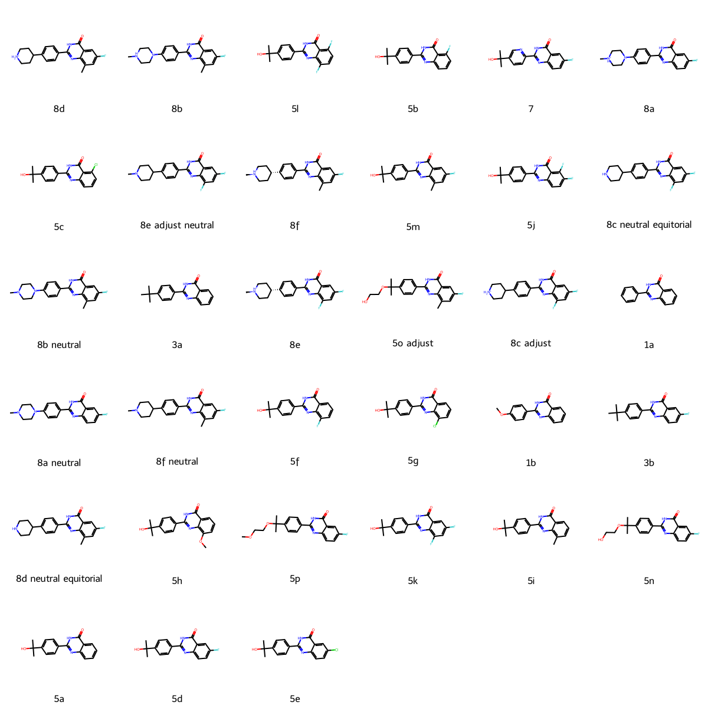

# TNKS2 System FEP Calculation Results Analysis

## Target Introduction

TNKS2 (Tankyrase-2, also known as PARP5B) is a member of the poly(ADP-ribose) polymerase (PARP) family that plays important roles in various cellular processes, including Wnt signaling pathway regulation, telomere maintenance, and mitotic spindle formation. Through its catalytic PARP domain, TNKS2 modifies target proteins by poly(ADP-ribosyl)ation, leading to their ubiquitination and subsequent degradation. Research has shown that TNKS2 inhibition can suppress Wnt/β-catenin signaling, making it a promising therapeutic target for cancers dependent on this pathway, particularly colorectal cancer. The development of selective TNKS2 inhibitors has attracted significant attention in cancer drug discovery.

## Dataset Analysis

The TNKS2 system dataset in this study comprises 34 compounds, primarily quinazolinone derivatives, with molecular weights ranging from 300 to 500 Da. The compounds share a common core scaffold while exhibiting diverse substitution patterns. These compounds feature key structural characteristics complementary to the TNKS2 catalytic site, including hydrogen bond donors and acceptors interacting with the nicotinamide binding pocket, aromatic systems forming π-stacking interactions, and various substituents exploring adjacent binding pockets.

The experimentally determined binding free energies range from -8.40 to -12.69 kcal/mol.

## Conclusions

The FEP calculation results for the TNKS2 system show that the predicted values (-7.83 to -12.47 kcal/mol) align with the experimental range. The overall prediction accuracy achieved an R² of 0.24 and an RMSE of 1.03 kcal/mol. Several compounds demonstrated good prediction results, such as compound 5a (experimental: -10.76 kcal/mol, predicted: -10.82 kcal/mol) and compound 5d (experimental: -10.89 kcal/mol, predicted: -10.94 kcal/mol). Good prediction accuracy was also observed for compound 5i (experimental: -12.08 kcal/mol, predicted: -11.96 kcal/mol). 