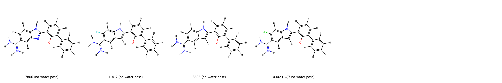

# Urokinase System FEP Calculation Results Analysis

> This README is generated by AI model using verified experimental data and Uni-FEP calculation results. Content may contain inaccuracies and is provided for reference only. No liability is assumed for outcomes related to its use.

## Introduction

Urokinase, also known as urokinase-type plasminogen activator (uPA), is a serine protease pivotal in the fibrinolytic system. It catalyzes the conversion of plasminogen to plasmin, a protease that degrades fibrin clots and participates in extracellular matrix remodeling. Beyond its role in fibrinolysis, urokinase is involved in physiological processes such as wound healing and pathological conditions like cancer metastasis, tissue remodeling, and fibrosis. As a therapeutic target, urokinase presents opportunities for managing cancer, thrombosis, and fibrotic diseases by blocking its role in matrix degradation and cell invasion.

## Molecules

The urokinase-waterset dataset analyzed here consists of 4 structurally diverse ligands. These compounds feature functional modifications such as halogen-substituted groups (e.g., fluorine and chlorine) and hydroxylated groups. These variations contribute significantly to their binding interactions in the active site of urokinase, influencing their binding affinity.

The experimentally determined binding free energies of these ligands are in the range of -8.65 kcal/mol to -10.82 kcal/mol, providing valuable data for exploring the structure-activity relationships within this dataset.

## Conclusions

The FEP calculation results for the urokinase-waterset demonstrate strong predictive accuracy, with an RMSE of 0.55 kcal/mol and an R² value of 0.60. This level of correlation underscores the utility of FEP methods in reliably capturing ligand-binding trends for this target.

Among the analyzed ligands, "10302 (1GJ7 no water pose)" displayed remarkable agreement between experimental and calculated binding free energies, with both values nearly identical at -10.82 kcal/mol. This highlight underscores the strength of FEP in achieving accurate predictions for specific ligands within this system.

Additionally, "11417 (no water pose)" showed strong alignment between experimental results and calculated trends, further exemplifying the fidelity of the FEP calculations within the dataset. These examples illustrate the capability of FEP to provide reliable insights into ligand-target interactions for urokinase inhibitors.